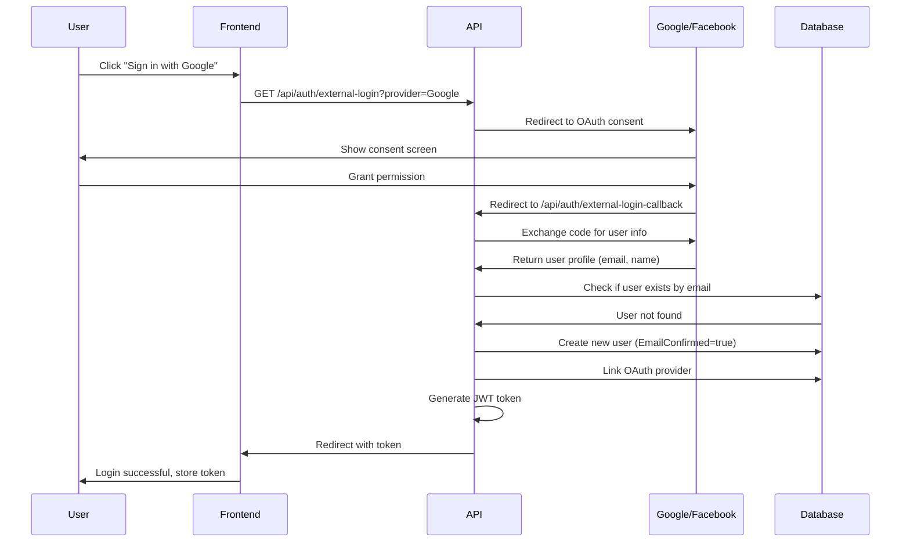
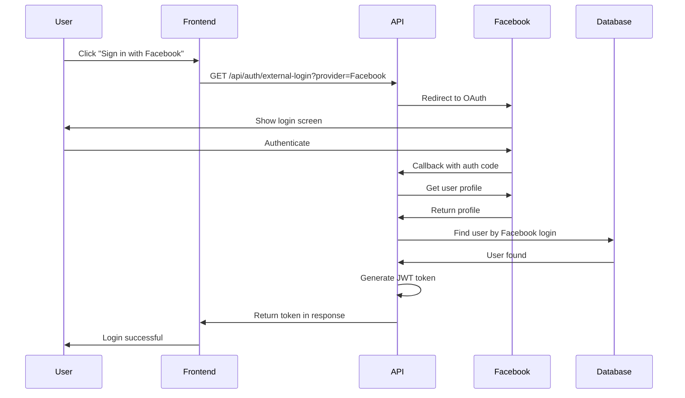
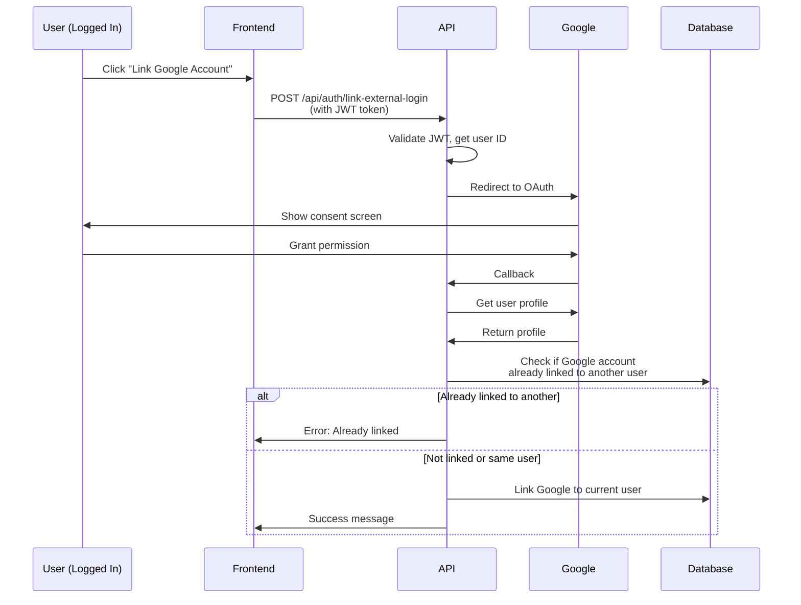

# ?? OAuth 2.0 Authentication Documentation

Complete guide for implementing OAuth 2.0 authentication with Google and Facebook in the Ghseeli APIs.

---

## ?? Table of Contents

- [Overview](#overview)
- [OAuth Setup](#oauth-setup)
- [API Endpoints](#api-endpoints)
- [Frontend Integration](#frontend-integration)
- [Security Best Practices](#security-best-practices)
- [Troubleshooting](#troubleshooting)

---

## ?? Overview

The Ghseeli APIs support multiple authentication methods:

### **JWT Bearer Token Authentication**
- Traditional email/password registration and login
- Secure JWT tokens with configurable expiration
- Role-based authorization (User, Company, Admin)

### **OAuth 2.0 External Authentication**
- **Google Sign-In** - Authenticate with Google accounts
- **Facebook Login** - Authenticate with Facebook accounts
- Automatic user creation on first OAuth login
- Link multiple OAuth providers to existing accounts
- Manage and remove linked providers

### **Key Benefits**
? **Seamless User Experience** - One-click social login  
? **Security** - No password management for OAuth users  
? **Flexibility** - Users can link multiple providers  
? **Auto-Verification** - OAuth users have verified emails  
? **Unified JWT Tokens** - Same token structure for all auth methods  

---

## ?? OAuth Setup

### **Step 1: Configure Google OAuth**

#### **1.1 Create Google Cloud Project**

1. Go to [Google Cloud Console](https://console.cloud.google.com/)
2. Click "Select a project" ? "New Project"
3. Enter project name: `Ghseeli` (or your choice)
4. Click "Create"

#### **1.2 Enable Google+ API**

1. Navigate to "APIs & Services" ? "Library"
2. Search for "Google+ API"
3. Click on "Google+ API"
4. Click "Enable"

#### **1.3 Create OAuth 2.0 Credentials**

1. Go to "APIs & Services" ? "Credentials"
2. Click "Create Credentials" ? "OAuth client ID"
3. If prompted, configure OAuth consent screen:
   - Choose "External" user type
   - Fill in app name: `Ghseeli`
   - Add support email
   - Add authorized domains (your domain)
   - Save and continue
4. Choose application type: "Web application"
5. Name: `Ghseeli Web Client`
6. Add **Authorized redirect URIs**:
   ```
   https://yourdomain.com/api/auth/google-callback
   http://localhost:5000/api/auth/google-callback
   https://localhost:7001/api/auth/google-callback
   ```
7. Click "Create"
8. **Copy the Client ID and Client Secret** (you'll need these!)

#### **1.4 OAuth Consent Screen Configuration**

1. Go to "APIs & Services" ? "OAuth consent screen"
2. Add Scopes:
   - `.../auth/userinfo.email`
   - `.../auth/userinfo.profile`
3. Add Test Users (for development):
   - Add your email addresses that will test the OAuth flow
4. Save changes

---

### **Step 2: Configure Facebook OAuth**

#### **2.1 Create Facebook App**

1. Go to [Facebook Developers](https://developers.facebook.com/)
2. Click "My Apps" ? "Create App"
3. Choose app type: "Consumer"
4. Display name: `Ghseeli`
5. Contact email: your email
6. Click "Create App"

#### **2.2 Add Facebook Login Product**

1. From app dashboard, click "Add Product"
2. Find "Facebook Login" and click "Set Up"
3. Choose "Web" platform
4. Enter Site URL: `https://yourdomain.com`
5. Click "Save" and "Continue"

#### **2.3 Configure Facebook Login Settings**

1. Go to "Facebook Login" ? "Settings"
2. Add **Valid OAuth Redirect URIs**:
   ```
   https://yourdomain.com/api/auth/facebook-callback
   http://localhost:5000/api/auth/facebook-callback
   https://localhost:7001/api/auth/facebook-callback
   ```
3. Enable these settings:
   - ? Client OAuth Login
   - ? Web OAuth Login
4. Save Changes

#### **2.4 Get App Credentials**

1. Go to "Settings" ? "Basic"
2. **Copy the App ID**
3. Click "Show" next to App Secret
4. **Copy the App Secret** (keep this secure!)

#### **2.5 Configure App for Development**

1. In "Settings" ? "Basic", set App Mode to "Development"
2. Add test users in "Roles" ? "Test Users"
3. Before going live, complete "App Review"

---

### **Step 3: Configure Application (Development)**

#### **3.1 Using User Secrets (Recommended for Development)**

```bash
# Navigate to your project directory
cd GhseeliApis

# Initialize user secrets
dotnet user-secrets init

# Set Google OAuth credentials
dotnet user-secrets set "Authentication:Google:ClientId" "YOUR_GOOGLE_CLIENT_ID.apps.googleusercontent.com"
dotnet user-secrets set "Authentication:Google:ClientSecret" "YOUR_GOOGLE_CLIENT_SECRET"

# Set Facebook OAuth credentials
dotnet user-secrets set "Authentication:Facebook:AppId" "YOUR_FACEBOOK_APP_ID"
dotnet user-secrets set "Authentication:Facebook:AppSecret" "YOUR_FACEBOOK_APP_SECRET"

# Set JWT Settings
dotnet user-secrets set "JwtSettings:SecretKey" "YourSuperSecretKeyThatIsAtLeast32CharactersLong!"
dotnet user-secrets set "JwtSettings:Issuer" "https://localhost:7001"
dotnet user-secrets set "JwtSettings:Audience" "https://localhost:7001"
dotnet user-secrets set "JwtSettings:ExpiresInHours" "24"
```

#### **3.2 Verify User Secrets**

```bash
# List all user secrets
dotnet user-secrets list

# Expected output:
# Authentication:Google:ClientId = YOUR_GOOGLE_CLIENT_ID
# Authentication:Google:ClientSecret = YOUR_GOOGLE_CLIENT_SECRET
# Authentication:Facebook:AppId = YOUR_FACEBOOK_APP_ID
# Authentication:Facebook:AppSecret = YOUR_FACEBOOK_APP_SECRET
# JwtSettings:SecretKey = YOUR_SECRET_KEY
# ...
```

#### **3.3 appsettings.json Configuration**

Your `appsettings.json` should have placeholder values (never commit real credentials):

```json
{
  "ConnectionStrings": {
    "DefaultConnection": "YOUR_CONNECTION_STRING"
  },
  "Authentication": {
    "Google": {
      "ClientId": "YOUR_GOOGLE_CLIENT_ID_HERE",
      "ClientSecret": "YOUR_GOOGLE_CLIENT_SECRET_HERE"
    },
    "Facebook": {
      "AppId": "YOUR_FACEBOOK_APP_ID_HERE",
      "AppSecret": "YOUR_FACEBOOK_APP_SECRET_HERE"
    }
  },
  "JwtSettings": {
    "SecretKey": "YOUR_JWT_SECRET_KEY_HERE",
    "Issuer": "https://localhost:7001",
    "Audience": "https://localhost:7001",
    "ExpiresInHours": 24
  },
  "Logging": {
    "LogLevel": {
      "Default": "Information",
      "Microsoft.AspNetCore": "Warning"
    }
  },
  "AllowedHosts": "*"
}
```

---

### **Step 4: Production Configuration**

#### **4.1 Environment Variables (Production)**

For production environments, use environment variables:

```bash
# Google OAuth
export Authentication__Google__ClientId="YOUR_GOOGLE_CLIENT_ID"
export Authentication__Google__ClientSecret="YOUR_GOOGLE_CLIENT_SECRET"

# Facebook OAuth
export Authentication__Facebook__AppId="YOUR_FACEBOOK_APP_ID"
export Authentication__Facebook__AppSecret="YOUR_FACEBOOK_APP_SECRET"

# JWT Settings
export JwtSettings__SecretKey="YOUR_PRODUCTION_SECRET_KEY"
export JwtSettings__Issuer="https://yourdomain.com"
export JwtSettings__Audience="https://yourdomain.com"
export JwtSettings__ExpiresInHours="24"
```

#### **4.2 Azure App Service Configuration**

If deploying to Azure:

1. Go to Azure Portal ? Your App Service
2. Navigate to "Configuration" ? "Application settings"
3. Click "New application setting" for each:
   - `Authentication__Google__ClientId`
   - `Authentication__Google__ClientSecret`
   - `Authentication__Facebook__AppId`
   - `Authentication__Facebook__AppSecret`
   - `JwtSettings__SecretKey`
   - `JwtSettings__Issuer`
   - `JwtSettings__Audience`
4. Save changes

#### **4.3 Google Secret Manager (GCP)**

If deploying to Google Cloud:

```bash
# Create secrets
gcloud secrets create google-oauth-client-id --data-file=- <<< "YOUR_CLIENT_ID"
gcloud secrets create google-oauth-client-secret --data-file=- <<< "YOUR_CLIENT_SECRET"
gcloud secrets create facebook-oauth-app-id --data-file=- <<< "YOUR_APP_ID"
gcloud secrets create facebook-oauth-app-secret --data-file=- <<< "YOUR_APP_SECRET"
gcloud secrets create jwt-secret-key --data-file=- <<< "YOUR_JWT_KEY"

# Grant access to your App Engine service account
gcloud secrets add-iam-policy-binding google-oauth-client-id \
    --member="serviceAccount:YOUR_PROJECT@appspot.gserviceaccount.com" \
    --role="roles/secretmanager.secretAccessor"
```

---

## ?? API Endpoints

### **Authentication Endpoints**

#### **1. Register with Email/Password**
```http
POST /api/auth/register
Content-Type: application/json

{
  "email": "user@example.com",
  "password": "SecurePass123!",
  "confirmPassword": "SecurePass123!",
  "fullName": "John Doe",
  "phoneNumber": "1234567890"
}
```

**Response (200 OK):**
```json
{
  "userId": "guid",
  "email": "user@example.com",
  "fullName": "John Doe",
  "token": "eyJhbGciOiJIUzI1NiIsInR5cCI6IkpXVCJ9...",
  "expiresAt": "2024-11-26T22:00:00Z"
}
```

#### **2. Login with Email/Password**
```http
POST /api/auth/login
Content-Type: application/json

{
  "email": "user@example.com",
  "password": "SecurePass123!"
}
```

**Response (200 OK):**
```json
{
  "userId": "guid",
  "email": "user@example.com",
  "fullName": "John Doe",
  "token": "eyJhbGciOiJIUzI1NiIsInR5cCI6IkpXVCJ9...",
  "expiresAt": "2024-11-26T22:00:00Z"
}
```

---

### **OAuth 2.0 Endpoints**

#### **3. Initiate OAuth Login**
```http
GET /api/auth/external-login?provider={Google|Facebook}&returnUrl={optional}
```

**Parameters:**
- `provider` (required): `Google` or `Facebook`
- `returnUrl` (optional): URL to redirect after successful authentication

**Behavior:**
- Redirects to OAuth provider's login page
- User grants permissions
- Provider redirects back to callback endpoint

#### **4. OAuth Callback (Automatic)**
```http
GET /api/auth/external-login-callback?returnUrl={optional}
```

**This endpoint is called by OAuth provider automatically. Not called directly by frontend.**

**Response (200 OK) - New User:**
```json
{
  "isNewUser": true,
  "userId": "new-user-guid",
  "email": "user@gmail.com",
  "fullName": "John Doe",
  "provider": "Google",
  "token": "eyJhbGciOiJIUzI1NiIsInR5cCI6IkpXVCJ9...",
  "expiresAt": "2024-11-26T22:00:00Z"
}
```

**Response (200 OK) - Existing User:**
```json
{
  "isNewUser": false,
  "userId": "existing-user-guid",
  "email": "existing@example.com",
  "fullName": "Jane Smith",
  "provider": "Facebook",
  "token": "eyJhbGciOiJIUzI1NiIsInR5cCI6IkpXVCJ9...",
  "expiresAt": "2024-11-26T22:00:00Z"
}
```

**If returnUrl provided:**
- Redirects to: `{returnUrl}?token={jwt_token}`

#### **5. Link OAuth Provider to Account**
```http
POST /api/auth/link-external-login
Authorization: Bearer {jwt_token}
Content-Type: application/json

{
  "provider": "Google",
  "returnUrl": "https://yourdomain.com/account-linked"
}
```

**Response:** 302 Redirect to OAuth provider

#### **6. OAuth Linking Callback (Automatic)**
```http
GET /api/auth/link-external-login-callback?returnUrl={optional}
Authorization: Bearer {jwt_token}
```

**Response (200 OK):**
```json
{
  "message": "Google linked successfully",
  "provider": "Google"
}
```

**If returnUrl provided:**
- Redirects to: `{returnUrl}?linked=true`

#### **7. Remove OAuth Provider**
```http
DELETE /api/auth/external-login/Google
Authorization: Bearer {jwt_token}
```

**Response (200 OK):**
```json
{
  "message": "Google removed successfully"
}
```

#### **8. List Linked OAuth Providers**
```http
GET /api/auth/external-logins
Authorization: Bearer {jwt_token}
```

**Response (200 OK):**
```json
[
  {
    "loginProvider": "Google",
    "providerKey": "123456789",
    "providerDisplayName": "Google"
  },
  {
    "loginProvider": "Facebook",
    "providerKey": "987654321",
    "providerDisplayName": "Facebook"
  }
]
```

#### **9. Validate JWT Token**
```http
POST /api/auth/validate
Content-Type: application/json

"eyJhbGciOiJIUzI1NiIsInR5cCI6IkpXVCJ9..."
```

**Response (200 OK):**
```json
{
  "isValid": true,
  "message": "Token is valid"
}
```

#### **10. Get Current User**
```http
GET /api/auth/me
Authorization: Bearer {jwt_token}
```

**Response (200 OK):**
```json
{
  "userId": "guid",
  "email": "user@example.com",
  "fullName": "John Doe"
}
```

---

## ?? Frontend Integration

### **HTML/JavaScript Example**

#### **Login Page**

```html
<!DOCTYPE html>
<html lang="en">
<head>
    <meta charset="UTF-8">
    <meta name="viewport" content="width=device-width, initial-scale=1.0">
    <title>Sign In - Ghseeli</title>
    <style>
        body {
            font-family: Arial, sans-serif;
            max-width: 400px;
            margin: 50px auto;
            padding: 20px;
        }
        .oauth-button {
            display: flex;
            align-items: center;
            justify-content: center;
            width: 100%;
            padding: 12px;
            margin: 10px 0;
            border: 1px solid #ddd;
            border-radius: 4px;
            background: white;
            cursor: pointer;
            font-size: 16px;
        }
        .oauth-button:hover {
            background: #f5f5f5;
        }
        .oauth-button img {
            width: 24px;
            height: 24px;
            margin-right: 12px;
        }
        .divider {
            text-align: center;
            margin: 20px 0;
            color: #666;
        }
    </style>
</head>
<body>
    <h1>Sign In to Ghseeli</h1>
    
    <!-- OAuth Buttons -->
    <button class="oauth-button" onclick="loginWithGoogle()">
        
        Continue with Google
    </button>
    
    <button class="oauth-button" onclick="loginWithFacebook()">
        
        Continue with Facebook
    </button>
    
    <div class="divider">OR</div>
    
    <!-- Traditional Login Form -->
    <form onsubmit="loginWithEmail(event)">
        <div>
            <label>Email:</label>
            <input type="email" id="email" required style="width: 100%; padding: 8px; margin: 5px 0;">
        </div>
        <div>
            <label>Password:</label>
            <input type="password" id="password" required style="width: 100%; padding: 8px; margin: 5px 0;">
        </div>
        <button type="submit" style="width: 100%; padding: 12px; margin-top: 10px; background: #4CAF50; color: white; border: none; border-radius: 4px; cursor: pointer;">
            Sign In
        </button>
    </form>

    <script>
        const API_BASE_URL = 'https://localhost:7001';
        
        // OAuth Login Functions
        function loginWithGoogle() {
            const returnUrl = window.location.origin + '/oauth-callback.html';
            window.location.href = `${API_BASE_URL}/api/auth/external-login?provider=Google&returnUrl=${encodeURIComponent(returnUrl)}`;
        }
        
        function loginWithFacebook() {
            const returnUrl = window.location.origin + '/oauth-callback.html';
            window.location.href = `${API_BASE_URL}/api/auth/external-login?provider=Facebook&returnUrl=${encodeURIComponent(returnUrl)}`;
        }
        
        // Traditional Email/Password Login
        async function loginWithEmail(event) {
            event.preventDefault();
            
            const email = document.getElementById('email').value;
            const password = document.getElementById('password').value;
            
            try {
                const response = await fetch(`${API_BASE_URL}/api/auth/login`, {
                    method: 'POST',
                    headers: {
                        'Content-Type': 'application/json'
                    },
                    body: JSON.stringify({ email, password })
                });
                
                if (response.ok) {
                    const data = await response.json();
                    localStorage.setItem('authToken', data.token);
                    window.location.href = '/dashboard.html';
                } else {
                    alert('Invalid email or password');
                }
            } catch (error) {
                console.error('Login error:', error);
                alert('An error occurred during login');
            }
        }
    </script>
</body>
</html>
```

#### **OAuth Callback Handler**

```html
<!DOCTYPE html>
<html lang="en">
<head>
    <meta charset="UTF-8">
    <meta name="viewport" content="width=device-width, initial-scale=1.0">
    <title>Processing Login...</title>
    <style>
        body {
            font-family: Arial, sans-serif;
            max-width: 600px;
            margin: 100px auto;
            text-align: center;
            padding: 20px;
        }
        .spinner {
            border: 4px solid #f3f3f3;
            border-top: 4px solid #3498db;
            border-radius: 50%;
            width: 40px;
            height: 40px;
            animation: spin 1s linear infinite;
            margin: 20px auto;
        }
        @keyframes spin {
            0% { transform: rotate(0deg); }
            100% { transform: rotate(360deg); }
        }
    </style>
</head>
<body>
    <h2>Processing your login...</h2>
    <div class="spinner"></div>
    <p id="status">Please wait while we sign you in...</p>

    <script>
        const API_BASE_URL = 'https://localhost:7001';
        
        // Extract token from URL query parameter
        const urlParams = new URLSearchParams(window.location.search);
        const token = urlParams.get('token');
        
        if (token) {
            // Store JWT token
            localStorage.setItem('authToken', token);
            
            // Fetch user info to confirm login
            fetch(`${API_BASE_URL}/api/auth/me`, {
                headers: {
                    'Authorization': `Bearer ${token}`
                }
            })
            .then(response => {
                if (response.ok) {
                    return response.json();
                }
                throw new Error('Failed to fetch user info');
            })
            .then(user => {
                console.log('Logged in user:', user);
                document.getElementById('status').innerHTML = 
                    `? Welcome back, ${user.fullName}!<br>Redirecting to your dashboard...`;
                
                // Redirect to main app after 1.5 seconds
                setTimeout(() => {
                    window.location.href = '/dashboard.html';
                }, 1500);
            })
            .catch(error => {
                console.error('Error:', error);
                document.getElementById('status').innerHTML = 
                    '? Login failed. Please <a href="/login.html">try again</a>.';
            });
        } else {
            // No token in URL
            document.getElementById('status').innerHTML = 
                '? No authentication token received.<br><a href="/login.html">Return to login</a>';
        }
    </script>
</body>
</html>
```

#### **Dashboard with Token Usage**

```html
<!DOCTYPE html>
<html lang="en">
<head>
    <meta charset="UTF-8">
    <meta name="viewport" content="width=device-width, initial-scale=1.0">
    <title>Dashboard - Ghseeli</title>
</head>
<body>
    <h1>Dashboard</h1>
    <div id="user-info"></div>
    <div id="bookings"></div>
    <button onclick="logout()">Logout</button>

    <script>
        const API_BASE_URL = 'https://localhost:7001';
        
        // Get stored token
        function getToken() {
            return localStorage.getItem('authToken');
        }
        
        // Check if user is authenticated
        function checkAuth() {
            const token = getToken();
            if (!token) {
                window.location.href = '/login.html';
                return false;
            }
            return true;
        }
        
        // Fetch user info
        async function fetchUserInfo() {
            if (!checkAuth()) return;
            
            try {
                const response = await fetch(`${API_BASE_URL}/api/auth/me`, {
                    headers: {
                        'Authorization': `Bearer ${getToken()}`
                    }
                });
                
                if (response.ok) {
                    const user = await response.json();
                    document.getElementById('user-info').innerHTML = 
                        `<h2>Welcome, ${user.fullName}!</h2><p>Email: ${user.email}</p>`;
                } else if (response.status === 401) {
                    // Token expired
                    logout();
                }
            } catch (error) {
                console.error('Error fetching user info:', error);
            }
        }
        
        // Fetch user bookings
        async function fetchBookings() {
            if (!checkAuth()) return;
            
            try {
                const response = await fetch(`${API_BASE_URL}/api/bookings/my-bookings`, {
                    headers: {
                        'Authorization': `Bearer ${getToken()}`
                    }
                });
                
                if (response.ok) {
                    const bookings = await response.json();
                    // Display bookings...
                    console.log('Bookings:', bookings);
                } else if (response.status === 401) {
                    logout();
                }
            } catch (error) {
                console.error('Error fetching bookings:', error);
            }
        }
        
        // Logout function
        function logout() {
            localStorage.removeItem('authToken');
            window.location.href = '/login.html';
        }
        
        // Initialize page
        fetchUserInfo();
        fetchBookings();
    </script>
</body>
</html>
```

### **Account Settings - Link/Unlink OAuth Providers**

```html
<!DOCTYPE html>
<html lang="en">
<head>
    <meta charset="UTF-8">
    <title>Account Settings</title>
</head>
<body>
    <h1>Account Settings</h1>
    <h2>Linked Accounts</h2>
    <div id="linked-accounts"></div>
    
    <h2>Link Additional Account</h2>
    <button onclick="linkGoogle()">Link Google</button>
    <button onclick="linkFacebook()">Link Facebook</button>

    <script>
        const API_BASE_URL = 'https://localhost:7001';
        
        function getToken() {
            return localStorage.getItem('authToken');
        }
        
        // Fetch and display linked OAuth providers
        async function fetchLinkedAccounts() {
            try {
                const response = await fetch(`${API_BASE_URL}/api/auth/external-logins`, {
                    headers: {
                        'Authorization': `Bearer ${getToken()}`
                    }
                });
                
                if (response.ok) {
                    const providers = await response.json();
                    const container = document.getElementById('linked-accounts');
                    
                    if (providers.length === 0) {
                        container.innerHTML = '<p>No linked accounts</p>';
                    } else {
                        container.innerHTML = providers.map(p => `
                            <div>
                                <strong>${p.providerDisplayName}</strong>
                                <button onclick="unlinkProvider('${p.loginProvider}')">Remove</button>
                            </div>
                        `).join('');
                    }
                }
            } catch (error) {
                console.error('Error:', error);
            }
        }
        
        // Link Google account
        async function linkGoogle() {
            const returnUrl = window.location.origin + '/account-linked.html';
            
            try {
                const response = await fetch(`${API_BASE_URL}/api/auth/link-external-login`, {
                    method: 'POST',
                    headers: {
                        'Authorization': `Bearer ${getToken()}`,
                        'Content-Type': 'application/json'
                    },
                    body: JSON.stringify({
                        provider: 'Google',
                        returnUrl: returnUrl
                    })
                });
                
                // Will redirect to Google OAuth
            } catch (error) {
                console.error('Error:', error);
            }
        }
        
        // Link Facebook account
        async function linkFacebook() {
            const returnUrl = window.location.origin + '/account-linked.html';
            
            try {
                const response = await fetch(`${API_BASE_URL}/api/auth/link-external-login`, {
                    method: 'POST',
                    headers: {
                        'Authorization': `Bearer ${getToken()}`,
                        'Content-Type': 'application/json'
                    },
                    body: JSON.stringify({
                        provider: 'Facebook',
                        returnUrl: returnUrl
                    })
                });
                
                // Will redirect to Facebook OAuth
            } catch (error) {
                console.error('Error:', error);
            }
        }
        
        // Unlink OAuth provider
        async function unlinkProvider(provider) {
            if (!confirm(`Remove ${provider} from your account?`)) return;
            
            try {
                const response = await fetch(`${API_BASE_URL}/api/auth/external-login/${provider}`, {
                    method: 'DELETE',
                    headers: {
                        'Authorization': `Bearer ${getToken()}`
                    }
                });
                
                if (response.ok) {
                    alert(`${provider} removed successfully`);
                    fetchLinkedAccounts(); // Refresh list
                } else {
                    alert('Failed to remove provider');
                }
            } catch (error) {
                console.error('Error:', error);
            }
        }
        
        // Initialize
        fetchLinkedAccounts();
    </script>
</body>
</html>
```

---

### **React/TypeScript Integration**

#### **AuthContext.tsx**

```typescript
import React, { createContext, useState, useContext, useEffect } from 'react';

interface User {
    userId: string;
    email: string;
    fullName: string;
}

interface AuthContextType {
    token: string | null;
    user: User | null;
    loading: boolean;
    login: (token: string) => void;
    logout: () => void;
    loginWithGoogle: () => void;
    loginWithFacebook: () => void;
}

const AuthContext = createContext<AuthContextType | undefined>(undefined);
const API_BASE_URL = process.env.REACT_APP_API_BASE_URL || 'https://localhost:7001';

export const AuthProvider: React.FC<{ children: React.ReactNode }> = ({ children }) => {
    const [token, setToken] = useState<string | null>(
        localStorage.getItem('authToken')
    );
    const [user, setUser] = useState<User | null>(null);
    const [loading, setLoading] = useState<boolean>(true);

    useEffect(() => {
        if (token) {
            fetchUserInfo();
        } else {
            setLoading(false);
        }
    }, [token]);

    const fetchUserInfo = async () => {
        try {
            const response = await fetch(`${API_BASE_URL}/api/auth/me`, {
                headers: {
                    'Authorization': `Bearer ${token}`
                }
            });
            
            if (response.ok) {
                const userData = await response.json();
                setUser(userData);
            } else {
                // Token invalid
                logout();
            }
        } catch (error) {
            console.error('Error fetching user info:', error);
            logout();
        } finally {
            setLoading(false);
        }
    };

    const login = (newToken: string) => {
        localStorage.setItem('authToken', newToken);
        setToken(newToken);
    };

    const logout = () => {
        localStorage.removeItem('authToken');
        setToken(null);
        setUser(null);
    };

    const loginWithGoogle = () => {
        const returnUrl = `${window.location.origin}/oauth-callback`;
        window.location.href = `${API_BASE_URL}/api/auth/external-login?provider=Google&returnUrl=${encodeURIComponent(returnUrl)}`;
    };

    const loginWithFacebook = () => {
        const returnUrl = `${window.location.origin}/oauth-callback`;
        window.location.href = `${API_BASE_URL}/api/auth/external-login?provider=Facebook&returnUrl=${encodeURIComponent(returnUrl)}`;
    };

    return (
        <AuthContext.Provider 
            value={{ 
                token, 
                user, 
                loading, 
                login, 
                logout, 
                loginWithGoogle, 
                loginWithFacebook 
            }}
        >
            {children}
        </AuthContext.Provider>
    );
};

export const useAuth = () => {
    const context = useContext(AuthContext);
    if (!context) {
        throw new Error('useAuth must be used within AuthProvider');
    }
    return context;
};
```

#### **Login Component**

```typescript
import React, { useState } from 'react';
import { useAuth } from './AuthContext';
import './Login.css';

const Login: React.FC = () => {
    const { loginWithGoogle, loginWithFacebook } = useAuth();
    const [email, setEmail] = useState('');
    const [password, setPassword] = useState('');
    const [error, setError] = useState('');
    const API_BASE_URL = process.env.REACT_APP_API_BASE_URL || 'https://localhost:7001';

    const handleEmailLogin = async (e: React.FormEvent) => {
        e.preventDefault();
        setError('');

        try {
            const response = await fetch(`${API_BASE_URL}/api/auth/login`, {
                method: 'POST',
                headers: {
                    'Content-Type': 'application/json'
                },
                body: JSON.stringify({ email, password })
            });

            if (response.ok) {
                const data = await response.json();
                localStorage.setItem('authToken', data.token);
                window.location.href = '/dashboard';
            } else {
                setError('Invalid email or password');
            }
        } catch (err) {
            setError('An error occurred during login');
            console.error('Login error:', err);
        }
    };

    return (
        <div className="login-container">
            <h1>Sign In to Ghseeli</h1>
            
            <div className="oauth-buttons">
                <button onClick={loginWithGoogle} className="oauth-btn google">
                    
                    Continue with Google
                </button>
                
                <button onClick={loginWithFacebook} className="oauth-btn facebook">
                    
                    Continue with Facebook
                </button>
            </div>

            <div className="divider">OR</div>

            <form onsubmit={handleEmailLogin}>
                <div className="form-group">
                    <label htmlFor="email">Email</label>
                    <input
                        type="email"
                        id="email"
                        value={email}
                        onChange={(e) => setEmail(e.target.value)}
                        required
                    />
                </div>

                <div className="form-group">
                    <label htmlFor="password">Password</label>
                    <input
                        type="password"
                        id="password"
                        value={password}
                        onChange={(e) => setPassword(e.target.value)}
                        required
                    />
                </div>

                {error && <div className="error-message">{error}</div>}

                <button type="submit" className="submit-btn">
                    Sign In
                </button>
            </form>

            <p className="signup-link">
                Don't have an account? <a href="/register">Sign up</a>
            </p>
        </div>
    );
};

export default Login;
```

#### **OAuth Callback Component**

```typescript
import React, { useEffect, useState } from 'react';
import { useNavigate, useSearchParams } from 'react-router-dom';
import { useAuth } from './AuthContext';

const OAuthCallback: React.FC = () => {
    const [searchParams] = useSearchParams();
    const { login } = useAuth();
    const navigate = useNavigate();
    const [status, setStatus] = useState('Processing login...');

    useEffect(() => {
        const token = searchParams.get('token');
        
        if (token) {
            setStatus('Login successful! Redirecting...');
            login(token);
            setTimeout(() => {
                navigate('/dashboard');
            }, 1000);
        } else {
            setStatus('Login failed. No token received.');
            setTimeout(() => {
                navigate('/login');
            }, 2000);
        }
    }, [searchParams, login, navigate]);

    return (
        <div style={{ textAlign: 'center', marginTop: '100px' }}>
            <h2>{status}</h2>
            <div className="spinner"></div>
        </div>
    );
};

export default OAuthCallback;
```

#### **Protected Route Component**

```typescript
import React from 'react';
import { Navigate } from 'react-router-dom';
import { useAuth } from './AuthContext';

interface ProtectedRouteProps {
    children: React.ReactNode;
}

const ProtectedRoute: React.FC<ProtectedRouteProps> = ({ children }) => {
    const { token, loading } = useAuth();

    if (loading) {
        return <div>Loading...</div>;
    }

    if (!token) {
        return <Navigate to="/login" replace />;
    }

    return <>{children}</>;
};

export default ProtectedRoute;
```

#### **App.tsx - Route Configuration**

```typescript
import React from 'react';
import { BrowserRouter, Routes, Route } from 'react-router-dom';
import { AuthProvider } from './AuthContext';
import Login from './Login';
import OAuthCallback from './OAuthCallback';
import Dashboard from './Dashboard';
import ProtectedRoute from './ProtectedRoute';

const App: React.FC = () => {
    return (
        <BrowserRouter>
            <AuthProvider>
                <Routes>
                    <Route path="/login" element={<Login />} />
                    <Route path="/oauth-callback" element={<OAuthCallback />} />
                    <Route 
                        path="/dashboard" 
                        element={
                            <ProtectedRoute>
                                <Dashboard />
                            </ProtectedRoute>
                        } 
                    />
                    <Route path="/" element={<Navigate to="/dashboard" />} />
                </Routes>
            </AuthProvider>
        </BrowserRouter>
    );
};

export default App;
```

---

## ?? Security Best Practices

### **1. Never Commit Credentials**

? **DON'T DO THIS:**
```json
{
  "Authentication": {
    "Google": {
      "ClientId": "123456789.apps.googleusercontent.com",
      "ClientSecret": "ACTUAL_SECRET_HERE"
    }
  }
}
```

? **DO THIS:**
```json
{
  "Authentication": {
    "Google": {
      "ClientId": "YOUR_GOOGLE_CLIENT_ID_HERE",
      "ClientSecret": "YOUR_GOOGLE_CLIENT_SECRET_HERE"
    }
  }
}
```

### **2. Use HTTPS in Production**

```csharp
// Program.cs - Production configuration
if (!app.Environment.IsDevelopment())
{
    app.UseHsts();
    app.UseHttpsRedirection();
}
```

Update OAuth callback URLs to use HTTPS:
```
https://yourdomain.com/api/auth/google-callback
https://yourdomain.com/api/auth/facebook-callback
```

### **3. Validate Redirect URIs**

Only allow specific redirect URIs in OAuth provider configurations. Never use wildcards in production.

### **4. Secure JWT Secret Key**

- Minimum 32 characters
- Use random, cryptographically secure key
- Different keys for dev/staging/production
- Rotate keys periodically

```bash
# Generate secure key (Linux/Mac)
openssl rand -base64 32

# Generate secure key (PowerShell)
[Convert]::ToBase64String((1..32 | ForEach-Object { Get-Random -Minimum 0 -Maximum 256 }))
```

### **5. Token Storage Best Practices**

? **Recommended:** `localStorage` for web apps
```javascript
localStorage.setItem('authToken', token);
```

? **More Secure:** `HttpOnly cookies` (requires backend changes)
```csharp
// Set cookie in controller
Response.Cookies.Append("authToken", token, new CookieOptions
{
    HttpOnly = true,
    Secure = true,
    SameSite = SameSiteMode.Strict
});
```

? **DON'T:** Store tokens in sessionStorage for long-term auth

### **6. Implement Token Refresh**

Consider implementing refresh tokens for long-lived sessions:

```typescript
async function refreshToken() {
    const response = await fetch(`${API_BASE_URL}/api/auth/refresh`, {
        method: 'POST',
        headers: {
            'Authorization': `Bearer ${getToken()}`
        }
    });
    
    if (response.ok) {
        const data = await response.json();
        localStorage.setItem('authToken', data.token);
    }
}
```

### **7. CORS Configuration**

```csharp
// Program.cs
builder.Services.AddCors(options =>
{
    options.AddPolicy("AllowFrontend", policy =>
    {
        policy.WithOrigins("https://yourdomain.com")
              .AllowAnyMethod()
              .AllowAnyHeader()
              .AllowCredentials();
    });
});

app.UseCors("AllowFrontend");
```

### **8. Rate Limiting**

Implement rate limiting for OAuth endpoints to prevent abuse:

```bash
dotnet add package AspNetCoreRateLimit
```

### **9. Security Headers**

```csharp
app.Use(async (context, next) =>
{
    context.Response.Headers.Add("X-Content-Type-Options", "nosniff");
    context.Response.Headers.Add("X-Frame-Options", "DENY");
    context.Response.Headers.Add("X-XSS-Protection", "1; mode=block");
    context.Response.Headers.Add("Referrer-Policy", "no-referrer");
    await next();
});
```

### **10. Monitor and Log**

- Log all OAuth authentication attempts
- Monitor failed login attempts
- Alert on suspicious activity
- Implement account lockout after N failed attempts

---

## ?? Troubleshooting

### **Common Issues and Solutions**

#### **1. "OAuth provider not configured"**

**Error:**
```
InvalidOperationException: Google ClientId is not configured
```

**Solution:**
- Verify user secrets are set: `dotnet user-secrets list`
- Check appsettings.json has correct structure
- Ensure environment variables are set (production)

#### **2. "redirect_uri_mismatch"**

**Error from Google/Facebook:**
```
Error 400: redirect_uri_mismatch
```

**Solution:**
- Verify callback URL in OAuth provider console matches exactly
- Check for trailing slashes: `/api/auth/google-callback` vs `/api/auth/google-callback/`
- Ensure protocol matches (http vs https)
- For localhost, add both http://localhost:5000 and https://localhost:7001

#### **3. "External login information not found"**

**Error in application:**
```json
{
  "message": "External login information not found"
}
```

**Possible Causes:**
- User cancelled OAuth consent screen
- Session expired between OAuth steps
- Cookies disabled in browser

**Solution:**
- Ask user to try again
- Ensure cookies are enabled
- Check SameSite cookie settings

#### **4. "Failed to link external login"**

**Error:**
```json
{
  "message": "Failed to link external login. It may already be linked to another account."
}
```

**Solution:**
- This provider is already linked to a different user account
- User must unlink from the other account first
- Or use a different OAuth provider

#### **5. JWT Token Invalid/Expired**

**Error:**
```json
{
  "message": "Invalid or expired token"
}
```

**Solution:**
- Token has expired (check `expiresAt` field)
- User needs to login again
- Implement token refresh mechanism
- Check JWT settings (Issuer, Audience) match

#### **6. CORS Errors**

**Error in browser console:**
```
Access to fetch at 'https://localhost:7001/api/auth/login' from origin 'http://localhost:3000' 
has been blocked by CORS policy
```

**Solution:**
```csharp
// Program.cs
builder.Services.AddCors(options =>
{
    options.AddDefaultPolicy(policy =>
    {
        policy.WithOrigins("http://localhost:3000")
              .AllowAnyMethod()
              .AllowAnyHeader();
    });
});

app.UseCors();
```

#### **7. Database Connection Issues**

**Error:**
```
Npgsql.NpgsqlException: Failed to connect to database
```

**Solution:**
- Verify Cloud SQL instance is running
- Check connection string is correct
- Ensure Cloud SQL Proxy is running (development)
- Verify firewall rules allow connection

#### **8. Facebook Specific - "App Not Setup"**

**Error:**
```
App Not Setup: This app is still in development mode
```

**Solution:**
- Add yourself as test user in Facebook App Dashboard
- Go to Roles ? Test Users ? Add Test User
- Or switch app to Live mode (requires App Review)

#### **9. Google Specific - "Access Blocked"**

**Error:**
```
Access blocked: Authorization Error
Error 403: access_denied
```

**Solution:**
- OAuth consent screen not configured properly
- Add your email to test users
- Verify OAuth scopes are approved
- Check if Google+ API is enabled

### **Testing OAuth Locally**

#### **1. Using ngrok for Callback Testing**

```bash
# Install ngrok
# https://ngrok.com/download

# Start your API
dotnet run

# In another terminal, expose local server
ngrok http 7001

# Update OAuth provider callback URLs with ngrok URL
# Example: https://abc123.ngrok.io/api/auth/google-callback
```

#### **2. Testing with Postman**

OAuth flows are difficult to test with Postman due to browser redirects.

Instead, test these endpoints:
```
POST /api/auth/register  (email/password)
POST /api/auth/login     (email/password)
POST /api/auth/validate  (token validation)
GET  /api/auth/me        (current user)
```

For OAuth, use browser-based testing or integration tests.

#### **3. Automated Testing**

OAuth controller tests use mocked `SignInManager`:

```csharp
_signInManagerMock.Setup(x => x.GetExternalLoginInfoAsync(It.IsAny<string>()))
    .ReturnsAsync(externalLoginInfo);
```

Run tests:
```bash
dotnet test
```

---

## ?? OAuth Flow Diagrams

### **New User OAuth Registration**



### **Existing User OAuth Login**



### **Link OAuth Provider to Existing Account**



---

## ?? Additional Resources

### **Official Documentation**
- [Google OAuth 2.0](https://developers.google.com/identity/protocols/oauth2)
- [Facebook Login Documentation](https://developers.facebook.com/docs/facebook-login)
- [ASP.NET Core Authentication](https://docs.microsoft.com/aspnet/core/security/authentication)
- [JWT Best Practices](https://tools.ietf.org/html/rfc8725)

### **OAuth Libraries**
- [Microsoft.AspNetCore.Authentication.Google](https://www.nuget.org/packages/Microsoft.AspNetCore.Authentication.Google)
- [Microsoft.AspNetCore.Authentication.Facebook](https://www.nuget.org/packages/Microsoft.AspNetCore.Authentication.Facebook)

### **Testing Tools**
- [JWT.io](https://jwt.io) - Decode and verify JWT tokens
- [OAuth Debugger](https://oauthdebugger.com) - Debug OAuth flows
- [ngrok](https://ngrok.com) - Expose localhost for OAuth testing

---

## ? OAuth Implementation Checklist

### **Backend Setup**
- [ ] Install Google and Facebook NuGet packages
- [ ] Configure appsettings.json with placeholders
- [ ] Set up user secrets for development
- [ ] Configure OAuth providers in Program.cs
- [ ] Implement OAuth service methods
- [ ] Create OAuth controller endpoints
- [ ] Write comprehensive unit tests
- [ ] Test OAuth flows manually

### **OAuth Provider Setup**
- [ ] Create Google Cloud project
- [ ] Enable Google+ API
- [ ] Create OAuth 2.0 credentials (Google)
- [ ] Configure callback URLs (Google)
- [ ] Create Facebook App
- [ ] Add Facebook Login product
- [ ] Configure redirect URIs (Facebook)
- [ ] Add test users to both platforms

### **Security**
- [ ] Use HTTPS in production
- [ ] Secure JWT secret key (32+ characters)
- [ ] Implement rate limiting
- [ ] Add security headers
- [ ] Configure CORS properly
- [ ] Never commit credentials
- [ ] Use environment variables in production
- [ ] Implement token refresh (optional)
- [ ] Add account lockout after failed attempts

### **Frontend Integration**
- [ ] Create OAuth login buttons
- [ ] Implement callback handler
- [ ] Store JWT tokens securely
- [ ] Add Authorization header to API requests
- [ ] Handle token expiration
- [ ] Implement logout functionality
- [ ] Add account linking UI
- [ ] Test full OAuth flow

### **Testing & Monitoring**
- [ ] Unit tests pass (461 tests)
- [ ] Manual testing with real OAuth providers
- [ ] Test account linking/unlinking
- [ ] Test error scenarios
- [ ] Log OAuth authentication attempts
- [ ] Monitor failed login attempts
- [ ] Set up alerts for suspicious activity

### **Documentation**
- [ ] Update README with OAuth information
- [ ] Document OAuth setup steps
- [ ] Provide frontend integration examples
- [ ] Create troubleshooting guide
- [ ] Add API endpoint documentation
- [ ] Document security best practices

---

## ?? Support

For OAuth implementation issues:

1. **Check Logs** - Review application logs for detailed error messages
2. **Verify Configuration** - Ensure all credentials are set correctly
3. **Test Endpoints** - Use browser and developer tools to test OAuth flow
4. **Review Documentation** - Reference this guide and official provider docs
5. **GitHub Issues** - Report bugs or ask questions in the repository

---

**Last Updated:** November 2024  
**API Version:** v1.0  
**OAuth Packages:** Microsoft.AspNetCore.Authentication.Google/Facebook 8.0.11

