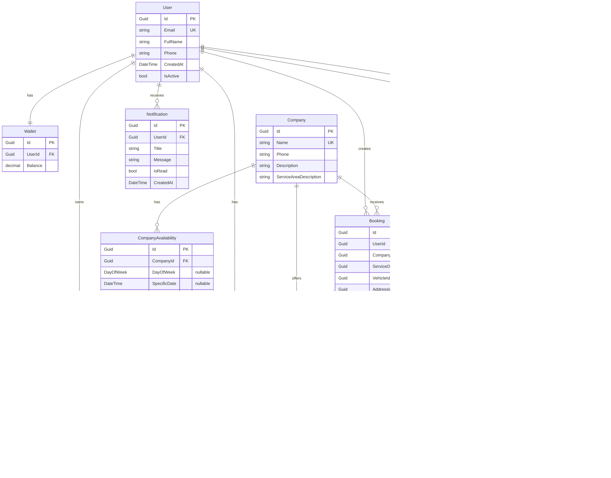

# ?? Ghseeli - Car Washing Service Platform

[](https://dotnet.microsoft.com/)
[](.)
[](https://cloud.google.com/sql)
[](https://docs.microsoft.com/ef/)
[](.)

A .NET solution for the Ghseeli vehicle-services platform.

## Backend applications

- `GhseeliApis` is the Customer API.
- `Ghseeli.BusinessApi` is the independently hosted Business API for owners and staff.
- `Ghseeli.IntegrationContracts` contains neutral versioned HTTP contracts shared between the APIs.

The APIs use separate identities, databases, configuration, migrations, domains, and deployments. They must not reference each other's implementation projects or query each other's databases. See [`API_BOUNDARIES.md`](API_BOUNDARIES.md).

## HTTP contract (Step 15)

[`STEP_15_HTTP_TEST_PLAN.md`](STEP_15_HTTP_TEST_PLAN.md) is the frozen
localization, error, transport, and OpenAPI oracle. It applies to localized
reads **and writes** on both independently hosted APIs, including legacy
Customer routes where Step 15 wraps an application-generated response.

### Language and Problem Details

- A documented `?language=` query is authoritative when present. Exactly one
  trimmed, nonblank `ar` or `he` value is valid, case-insensitively. Blank,
  duplicate, comma-delimited, or unsupported values return localized
  `400 language_invalid`; they never fall back to the header.
- Otherwise, `Accept-Language` selects the supported range with the greatest
  positive quality and then first wire position. `ar-*` and `he-*` normalize to
  `ar` and `he`. Missing, malformed, unsupported, wildcard-only, or all-`q=0`
  headers default safely to Arabic. Optional missing Hebrew content falls back
  to required Arabic content.
- Localized success and error responses use the same selected language, emit
  `Content-Language: ar|he`, and merge `Vary: Accept-Language`. Language changes
  presentation only—not auth, ownership, versions, money, persistence,
  selection validation, or idempotency.
- Internal HMAC and Stripe webhook diagnostics remain safe English
  machine-to-machine contracts and omit `language` and `Content-Language`.
  Health and Swagger are language-neutral.

Application failures use `application/problem+json` with stable `type`
(`https://api.ghseeli.example/errors/{code}`), `title`, `status`, `detail`,
`code`, and `correlationId`. Localized problems also contain `language`.
`fieldErrors` appears only for field failures and uses deterministic,
ordinally ordered camelCase JSON paths and localized messages. The generic
registry is:

| Status | Stable codes |
|---:|---|
| 400 | `language_invalid`, `request_invalid` |
| 401 | `customer_authentication_required`, `business_authentication_required` |
| 403 | `customer_authorization_forbidden`, `business_authorization_forbidden` |
| 404 | `resource_not_found` |
| 405 | `method_not_allowed` |
| 409 | `request_conflict` |
| 413 | `request_body_too_large` |
| 415 | `unsupported_media_type` |
| 500 | `unexpected_error` |
| 503 | `service_unavailable` |

Feature registries (`device_*`, `configuration_*`, `catalog_*`, `checkout_*`,
`pricing_*`, `booking_*`, `payment_*`, `stripe_*`, `internal_*`, and Business
domain codes) take precedence. Existing Step 3 and Steps 5–14 mappings remain
stable. Problems and logs never disclose exception/SQL/provider internals,
attempted sensitive values, PII, JWT/device/HMAC/Stripe secrets, raw webhook
bodies, idempotency keys, or internal row IDs.

### Authentication and request headers

| Operation family | Required security |
|---|---|
| Customer legacy protected routes | Customer bearer JWT |
| Customer configuration, catalog, drafts, and pricing | `X-Device-Token` |
| Customer booking confirmation and payment | Customer bearer JWT **and** `X-Device-Token` |
| Business owner/staff management | Business bearer JWT plus role/assignment policy |
| Either host's `/api/v1/internal/*` | Full HMAC quartet only |
| Stripe webhook | `Stripe-Signature` only |

The HMAC quartet is `X-Ghseeli-Service-Id`, `X-Ghseeli-Timestamp`,
`X-Ghseeli-Nonce`, and `X-Ghseeli-Signature`; internal mutation/validation
operations also use bounded `Idempotency-Key`. Device registration, implemented
auth entry points, implemented OAuth initiation/callbacks, health, enabled
Swagger, and Stripe webhook have explicit anonymous/bearer exemptions.
Protected OAuth link/unlink operations remain Customer-JWT protected. No
credential type substitutes for another, and Customer and Business JWTs are
never accepted cross-host.

Booking confirmation requires both auth factors, bounded
`Idempotency-Key`, and `X-Order-Guid`; the header must match the logical draft
order and drives the stable `booking-{orderGuid:N}` replay identity. Draft
repricing uses `X-Order-Guid` with body `expectedVersion`. Payment intent
creation requires bounded `Idempotency-Key`. Duplicate security, device,
idempotency, order-GUID, HMAC, or signature headers fail closed.

### Pricing, selections, and payment ownership

Add-on `selectionType` is a string enum:
`SingleChoice`, `SegmentedSingleButtonChoice`, `MultipleChoice`,
`QuantityCounter`, or `FixedIncludedChoice`. The server enforces required,
default, active, duplicate, min/max, and quantity rules. Item/add-on ordering
does not change semantic replay identity, and normalized output ordering is
deterministic.

Direct repricing is stateless; draft repricing persists an immutable snapshot.
Business remains authoritative for catalog selections, base/add-on prices,
duration, service area, and slot. Customer applies only configured disclosed
discount, service-fee, and tax components. The server owns normalized
selections, catalog version, quote time, subtotals, discounts, fee, taxable
subtotal, tax, total, currency, duration, and payment capabilities. Client
price/currency/fee/tax/discount/total/provider/payment-state fields and unknown
extensions cannot override them.

Payment-intent JSON contains only public `bookingId` and method `Card`; it
never accepts a Stripe PaymentMethod ID. Amount and currency come only from the
owned immutable booking. The server creates an unconfirmed intent and returns
client-safe confirmation data. `Wallet`, `CashOnArrival`, and `ThirdParty`
remain unavailable with stable localized reason codes. Only a verified Stripe
webhook may make a booking paid or reconcile a refund.

### Correlation, caching, and security headers

Every response has a bounded `X-Correlation-Id`; a valid caller value is echoed,
otherwise it is safely replaced. Problems and sensitive/mutable successes are
`Cache-Control: no-store`; problems have no validator or cookie headers. Both
hosts add `nosniff`, `DENY`, `no-referrer`, restrictive CSP, and restrictive
`Permissions-Policy` headers to all response paths. Swagger UI has a separate
narrow CSP. Production HTTPS emits configured HSTS; development/plain HTTP
does not. Internal HTTP still fails closed unless the explicit trusted local
override is enabled.

### Independent Swagger

Each host exposes its own `/swagger/v1/swagger.json` and `/swagger` only in
Development or explicit non-production configuration; Production/default is
404. Customer Swagger contains only Customer/legacy/internal callback/Stripe
routes, and Business Swagger only Business/internal routes. Each document
defines per-operation (never global) Customer bearer, Business bearer, device,
complete HMAC, Stripe signature, `Idempotency-Key`, and `X-Order-Guid`
requirements and exemptions.

Both documents include deterministic operation IDs, summaries/descriptions,
tags, schemas, requiredness/nullability, formats, bounds, string enums,
defaults, safe Arabic/Hebrew and machine examples, all runtime response
statuses, `application/problem+json`, and correlation/cache/localization
headers. Examples contain placeholders only and document language precedence,
64 KiB limits, replay/conflict behavior, ownership masking, authoritative
pricing, and payment capability semantics.

```shell
# Build the complete solution
dotnet build GhseeliApis.sln

# Run all tests
dotnet test GhseeliApis.sln

# Run Customer API
dotnet run --project GhseeliApis\GhseeliApis.csproj

# Run Business API
dotnet run --project Ghseeli.BusinessApi\Ghseeli.BusinessApi.csproj
```

## Fresh database baseline

Both APIs now use one clean SQL Server initial migration. The deleted migration history must not be applied to an existing database. Because this project has no production data, delete/recreate the old Customer and Business databases before applying the new baseline.

```powershell
# Run from the solution directory after configuring each connection string
dotnet ef database drop --force --project GhseeliApis\GhseeliApis.csproj --startup-project GhseeliApis\GhseeliApis.csproj
dotnet ef database update --project GhseeliApis\GhseeliApis.csproj --startup-project GhseeliApis\GhseeliApis.csproj

dotnet ef database drop --force --project Ghseeli.BusinessApi\Ghseeli.BusinessApi.csproj --startup-project Ghseeli.BusinessApi\Ghseeli.BusinessApi.csproj
dotnet ef database update --project Ghseeli.BusinessApi\Ghseeli.BusinessApi.csproj --startup-project Ghseeli.BusinessApi\Ghseeli.BusinessApi.csproj
```

Always verify the configured database name before running either destructive `database drop` command.

---

## ?? **Table of Contents**

- [Features](#-features)
- [Architecture](#-architecture)
- [Database Schema](#-database-schema)
- [Prerequisites](#-prerequisites)
- [Installation](#-installation)
- [Configuration](#-configuration)
- [Running the Application](#-running-the-application)
- [Testing](#-testing)
- [API Endpoints](#-api-endpoints)
- [Project Structure](#-project-structure)
- [Technologies](#-technologies)

---

## ? **Features**

### **Core Functionality**
- ?? **User Management** - ASP.NET Identity integration with custom user profiles
- ?? **Vehicle Management** - Users can manage multiple vehicles
- ?? **Address Management** - Save multiple service addresses
- ?? **Company Management** - Service provider profiles and availability
- ?? **Service Catalog** - Multiple service types with customizable options
- ?? **Anonymous Checkout Drafts** - Device-owned draft intents with expiry and optimistic versioning
- ?? **Booking System** - Complete booking lifecycle management
- ?? **Payment Processing** - Multiple payment methods with refund support
- ?? **Wallet System** - Digital wallet for users
- ?? **Notifications** - User notification system

### **Business Features**
- **Booking Lifecycle:** Pending ? Confirmed ? In Progress ? Completed
- **Payment Status:** Pending ? Completed ? Refunded
- **Time Slot Management** - Conflict detection and availability checking
- **Company Availability** - Recurring and one-time availability slots
- **Service Duration Calculation** - Automatic end time calculation

---

## ??? **Architecture**

The application follows **Clean Architecture** principles with clear separation of concerns:

```
???????????????????????????????????????????????????????????????
?                      Presentation Layer                      ?
?                    (API Controllers)                         ?
???????????????????????????????????????????????????????????????
?                      Business Logic Layer                    ?
?                        (Handlers)                            ?
???????????????????????????????????????????????????????????????
?                      Data Access Layer                       ?
?                     (Repositories)                           ?
???????????????????????????????????????????????????????????????
?                      Database Layer                          ?
?              (Google Cloud SQL - PostgreSQL)                 ?
???????????????????????????????????????????????????????????????
```

### **Design Patterns Used**
- ? **Repository Pattern** - Data access abstraction
- ? **Handler Pattern** - Business logic isolation
- ? **Dependency Injection** - Loose coupling
- ? **DTO Pattern** - API request/response models
- ? **Validation Pattern** - IValidatable interface

---

## ??? **Database Schema**

### **Entity Relationship Diagram**


```mermaid
erDiagram
    User ||--o{ Vehicle : owns
    User ||--o{ UserAddress : has
    User ||--o{ Booking : creates
    User ||--|| Wallet : has
    User ||--o{ WalletTransaction : performs
    User ||--o{ Notification : receives
    User ||--o{ Payment : makes
    
    Company ||--o{ ServiceOption : offers
    Company ||--o{ CompanyAvailability : has
    Company ||--o{ Booking : receives
    
    Service ||--o{ ServiceOption : has
    
    Booking }o--|| ServiceOption : uses
    Booking }o--|| Vehicle : for
    Booking }o--|| UserAddress : at
    Booking ||--|| Payment : paid-by
    
    WalletTransaction }o--o| Booking : relates-to
    
    User {
        Guid Id PK
        string Email UK
        string FullName
        string Phone
        DateTime CreatedAt
        bool IsActive
    }
    
    Vehicle {
        Guid Id PK
        Guid UserId FK
        string Make
        string Model
        string Year
        string LicensePlate
        string Color
    }
    
    UserAddress {
        Guid Id PK
        Guid UserId FK
        string AddressLine
        string City
        string Area
        double Latitude
        double Longitude
        bool IsPrimary
    }
    
    Company {
        Guid Id PK
        string Name UK
        string Phone
        string Description
        string ServiceAreaDescription
    }
    
    Service {
        Guid Id PK
        string Name UK
        string Description
    }
    
    ServiceOption {
        Guid Id PK
        Guid ServiceId FK
        Guid CompanyId FK "nullable"
        string Name
        decimal Price
        int DurationMinutes
    }
    
    Booking {
        Guid Id PK
        Guid UserId FK
        Guid CompanyId FK
        Guid ServiceOptionId FK
        Guid VehicleId FK
        Guid AddressId FK
        DateTime StartDateTime
        DateTime EndDateTime
        BookingStatus Status
        bool IsPaid
    }
    
    Payment {
        Guid Id PK
        Guid BookingId FK
        Guid UserId FK
        decimal Amount
        PaymentMethod Method
        PaymentStatus Status
        string TransactionId
        DateTime CreatedAt
    }
    
    Wallet {
        Guid Id PK
        Guid UserId FK
        decimal Balance
    }
    
    WalletTransaction {
        Guid Id PK
        Guid UserId FK
        Guid BookingId FK "nullable"
        decimal Amount
        string Description
        DateTime CreatedAt
    }
    
    CompanyAvailability {
        Guid Id PK
        Guid CompanyId FK
        DayOfWeek DayOfWeek "nullable"
        DateTime SpecificDate "nullable"
        TimeSpan StartTime
        TimeSpan EndTime
        TimeAvailabilityStatus Status
    }
    
    Notification {
        Guid Id PK
        Guid UserId FK
        string Title
        string Message
        bool IsRead
        DateTime CreatedAt
    }
```

### **Key Relationships Explained**

#### **1. User Relationships**
- **User ? Vehicles (1:N)** - A user can own multiple vehicles
  - *Why:* Users may have multiple cars (personal, family)
  - *Delete Behavior:* Cascade (when user deleted, vehicles deleted)

- **User ? Addresses (1:N)** - A user can have multiple service addresses
  - *Why:* Home, work, or other locations
  - *Delete Behavior:* Cascade

- **User ? Wallet (1:1)** - Each user has exactly one wallet
  - *Why:* Single balance per user for simplicity
  - *Delete Behavior:* Cascade

- **User ? Bookings (1:N)** - A user can create multiple bookings
  - *Why:* Regular service users
  - *Delete Behavior:* Restrict (preserve booking history)

#### **2. Company Relationships**
- **Company ? ServiceOptions (1:N)** - Companies offer custom pricing
  - *Why:* Different companies may charge different prices
  - *Delete Behavior:* Set Null (generic service options preserved)

- **Company ? Bookings (1:N)** - Companies receive bookings
  - *Why:* Track which company serves which booking
  - *Delete Behavior:* Restrict (preserve history)

- **Company ? Availabilities (1:N)** - Define when company is available
  - *Why:* Companies have different operating hours
  - *Delete Behavior:* Cascade

#### **3. Booking Relationships**
- **Booking ? Payment (1:1)** - Each booking has one payment
  - *Why:* Single payment per service
  - *Delete Behavior:* Cascade (delete payment if booking deleted)

- **Booking ? ServiceOption (N:1)** - Multiple bookings can use same service
  - *Why:* Reusable service templates
  - *Delete Behavior:* Restrict (don't delete popular services)

- **Booking ? Vehicle (N:1)** - Multiple bookings for same vehicle
  - *Why:* Vehicle service history
  - *Delete Behavior:* Restrict (preserve history)

- **Booking ? Address (N:1)** - Multiple bookings at same address
  - *Why:* Repeat customers at same location
  - *Delete Behavior:* Restrict (preserve history)

#### **4. Service Structure**
- **Service ? ServiceOptions (1:N)** - Base service with variations
  - *Why:* "Basic Wash" ? [Small Car, Large Car, SUV pricing]
  - *Delete Behavior:* Cascade (delete options when service deleted)

#### **5. Payment & Wallet**
- **Payment ? Booking (1:1)** - Payment tied to specific booking
  - *Why:* Track what was paid for
  - *Delete Behavior:* Cascade

- **WalletTransaction ? Booking (N:1 optional)** - Some transactions relate to bookings
  - *Why:* Track wallet payments vs deposits
  - *Delete Behavior:* Set Null (preserve transaction even if booking deleted)

---

## ?? **Prerequisites**

- **.NET SDK 8.0 or 9.0** - [Download](https://dotnet.microsoft.com/download)
- **Google Cloud SQL** - PostgreSQL instance
- **Google Cloud SDK** - [Install](https://cloud.google.com/sdk/docs/install)
- **Visual Studio 2022** or **VS Code** (optional)
- **Git** - Version control

---

## ?? **Installation**

### **1. Clone the Repository**
```bash
git clone https://github.com/mohanadHaji/GhseeliApis.git
cd GhseeliApis
```

### **2. Restore Dependencies**
```bash
dotnet restore
```

### **3. Set Up Google Cloud SQL**

#### **Create PostgreSQL Instance:**
```bash
gcloud sql instances create ghseeli-db \
  --database-version=POSTGRES_15 \
  --tier=db-f1-micro \
  --region=us-central1
```

#### **Create Database:**
```bash
gcloud sql databases create ghseeli --instance=ghseeli-db
```

#### **Create Database User:**
```bash
gcloud sql users create ghseeli-user \
  --instance=ghseeli-db \
  --password=YOUR_SECURE_PASSWORD
```

### **4. Configure Connection String**

Edit `appsettings.Development.json`:

```json
{
  "ConnectionStrings": {
    "DefaultConnection": "Host=YOUR_CLOUD_SQL_IP;Database=ghseeli;Username=ghseeli-user;Password=YOUR_PASSWORD"
  },
  "Logging": {
    "LogLevel": {
      "Default": "Information",
      "Microsoft.AspNetCore": "Warning"
    }
  }
}
```

**For Cloud SQL Proxy:**
```json
{
  "ConnectionStrings": {
    "DefaultConnection": "Host=/cloudsql/YOUR_PROJECT:REGION:INSTANCE_NAME;Database=ghseeli;Username=ghseeli-user;Password=YOUR_PASSWORD"
  }
}
```

---

## ?? **Configuration**

### **appsettings.json Structure**

```json
{
  "ConnectionStrings": {
    "DefaultConnection": "YOUR_CONNECTION_STRING"
  },
  "Logging": {
    "LogLevel": {
      "Default": "Information",
      "Microsoft.AspNetCore": "Warning",
      "GhseeliApis": "Information"
    }
  },
  "AllowedHosts": "*"
}
```

### **Environment Variables (Optional)**

```bash
export ASPNETCORE_ENVIRONMENT=Development
export ConnectionStrings__DefaultConnection="YOUR_CONNECTION_STRING"
```

---

## ?? **Running the Application**

### **1. Apply Database Migrations**
```bash
cd GhseeliApis
dotnet ef database update
```

### **2. Run the Application**
```bash
dotnet run
```

The API will be available at:
- **HTTPS:** `https://localhost:7001`
- **HTTP:** `http://localhost:5000`
- **Customer Swagger UI:** `<customer-base-url>/swagger`
- **Customer OpenAPI JSON:** `<customer-base-url>/swagger/v1/swagger.json`
- **Business Swagger UI:** `<business-base-url>/swagger`
- **Business OpenAPI JSON:** `<business-base-url>/swagger/v1/swagger.json`

Swagger is enabled in Development or by explicit non-production configuration;
it is disabled by default in Production.

### **3. Using Cloud SQL Proxy (Recommended for Development)**

**Start the proxy:**
```bash
cloud_sql_proxy -instances=YOUR_PROJECT:REGION:INSTANCE_NAME=tcp:5432
```

**Then run the application:**
```bash
dotnet run
```

---

## ?? **Testing**

### **Run All Tests**
```bash
dotnet test
```

### **Run Tests with Coverage**
```bash
dotnet test --collect:"XPlat Code Coverage"
```

### **Test Statistics**
- **Total Tests:** 461
- **Passing:** 461 (100%)
- **Duration:** ~2.7 seconds
- **Coverage:** Handlers (100%), Controllers (100%), Services (100%), Models (73%), Infrastructure (100%)

### **Test Categories**
- **Handler Tests:** 119 tests - Business logic with Moq
- **Controller Tests:** 55 tests - API endpoint validation
- **Service Tests:** 36 tests - OAuth authentication service (18 OAuth service + 18 OAuth controller)
- **Auth Tests:** 43 tests - JWT + OAuth authentication
- **Model Validation:** 49 tests - Data integrity
- **Infrastructure:** 30 tests - Logger, validators

---

## ?? **API Endpoints**

### **Users**
```
GET    /api/users              - Get all users
GET    /api/users/{id}         - Get user by ID
POST   /api/users              - Create user
PUT    /api/users/{id}         - Update user
DELETE /api/users/{id}         - Delete user
```

### **Vehicles**
```
GET    /api/vehicles                - Get all vehicles
GET    /api/vehicles/{id}           - Get vehicle by ID
GET    /api/vehicles/user/{userId}  - Get user's vehicles
POST   /api/vehicles                - Create vehicle
PUT    /api/vehicles/{id}           - Update vehicle
DELETE /api/vehicles/{id}           - Delete vehicle
```

### **Addresses**
```
GET    /api/addresses                - Get all addresses
GET    /api/addresses/{id}           - Get address by ID
GET    /api/addresses/user/{userId}  - Get user's addresses
POST   /api/addresses                - Create address
PUT    /api/addresses/{id}           - Update address
DELETE /api/addresses/{id}           - Delete address
PUT    /api/addresses/{id}/primary   - Set as primary
```

### **Companies**
```
GET    /api/companies        - Get all companies
GET    /api/companies/{id}   - Get company by ID
POST   /api/companies        - Create company
PUT    /api/companies/{id}   - Update company
DELETE /api/companies/{id}   - Delete company
```

### **Services**
```
GET    /api/services        - Get all services
GET    /api/services/{id}   - Get service by ID
POST   /api/services        - Create service
PUT    /api/services/{id}   - Update service
DELETE /api/services/{id}   - Delete service
```

### **Service Options**
```
GET    /api/serviceoptions                     - Get all service options
GET    /api/serviceoptions/{id}                - Get service option by ID
GET    /api/serviceoptions/service/{serviceId} - Get options for service
GET    /api/serviceoptions/company/{companyId} - Get company's options
POST   /api/serviceoptions                     - Create service option
PUT    /api/serviceoptions/{id}                - Update service option
DELETE /api/serviceoptions/{id}                - Delete service option
```

### **Bookings**
```
GET    /api/bookings                      - Get all bookings
GET    /api/bookings/{id}                 - Get booking by ID
GET    /api/bookings/user/{userId}        - Get user's bookings
GET    /api/bookings/company/{companyId}  - Get company's bookings
POST   /api/bookings                      - Create booking
PUT    /api/bookings/{id}                 - Update booking
POST   /api/bookings/{id}/cancel          - Cancel booking
POST   /api/bookings/{id}/confirm         - Confirm booking (company)
POST   /api/bookings/{id}/start           - Start service (company)
POST   /api/bookings/{id}/complete        - Complete service (company)
```

### **Payments**
```
POST   /api/v1/payments/intents       - Create an idempotent Stripe intent from an owned booking total
GET    /api/v1/payments/{id}          - Get an owned payment (customer JWT + device token)
POST   /api/stripe/webhook            - Verify and durably process bounded Stripe events
```

Payment requests never accept amount, currency, transaction, or paid/status fields.
They also never accept a Stripe PaymentMethod ID: the server creates an unconfirmed intent
and returns client-safe confirmation data. Unknown extension fields are ignored and cannot
change server-owned totals. Only verified Stripe webhooks can mark a confirmed customer
booking paid. The legacy unversioned payment mutation routes are disabled.

### **Health Check**
```
GET    /api/health        - Database health check
```

### **Authentication & OAuth 2.0** ??
```
POST   /api/auth/register                       - Register with email/password
POST   /api/auth/login                          - Login with email/password
POST   /api/auth/validate                       - Validate JWT token
GET    /api/auth/me                             - Get current user [Authorize]

GET    /api/auth/external-login                 - Initiate OAuth (Google/Facebook)
GET    /api/auth/external-login-callback        - OAuth callback handler
POST   /api/auth/link-external-login            - Link OAuth provider [Authorize]
GET    /api/auth/link-external-login-callback   - OAuth link callback [Authorize]
DELETE /api/auth/external-login/{provider}      - Remove OAuth provider [Authorize]
GET    /api/auth/external-logins                - List linked providers [Authorize]
```

**?? Detailed OAuth Documentation:** See [OAUTH_DOCUMENTATION.md](./OAUTH_DOCUMENTATION.md)

---

## ?? **Project Structure**

```
GhseeliApis/
??? Controllers/              # API Controllers
?   ??? UsersController.cs
?   ??? VehiclesController.cs
?   ??? AddressesController.cs
?   ??? CompaniesController.cs
?   ??? ServicesController.cs
?   ??? ServiceOptionsController.cs
?   ??? BookingsController.cs
?   ??? PaymentsController.cs
?   ??? HealthController.cs
?
??? Handlers/                 # Business Logic
?   ??? Interfaces/
?   ?   ??? IUserHandler.cs
?   ?   ??? IVehicleHandler.cs
?   ?   ??? IBookingHandler.cs
?   ?   ??? IPaymentHandler.cs
?   ??? UserHandler.cs
?   ??? VehicleHandler.cs
?   ??? BookingHandler.cs
?   ??? PaymentHandler.cs
?
??? Repositories/             # Data Access
?   ??? Interfaces/
?   ?   ??? IUserRepository.cs
?   ?   ??? IVehicleRepository.cs
?   ?   ??? IBookingRepository.cs
?   ??? UserRepository.cs
?   ??? VehicleRepository.cs
?   ??? BookingRepository.cs
?
??? Models/                   # Domain Entities
?   ??? User.cs
?   ??? Vehicle.cs
?   ??? Booking.cs
?   ??? Payment.cs
?   ??? Wallet.cs
?   ??? Enums/
?       ??? BookingStatus.cs
?       ??? PaymentStatus.cs
?       ??? PaymentMethod.cs
?
??? DTOs/                     # Data Transfer Objects
?   ??? User/
?   ??? Vehicle/
?   ??? Booking/
?   ??? Payment/
?
??? Persistence/              # Database Context
?   ??? ApplicationDbContext.cs
?   ??? ApplicationDbContextFactory.cs
?
??? Logger/                   # Logging Infrastructure
?   ??? Interfaces/
?   ?   ??? IAppLogger.cs
?   ??? ConsoleLogger.cs
?
??? Validators/               # Validation Utilities
?   ??? IdValidator.cs
?
??? Extensions/               # Extension Methods
?   ??? GoogleSqlSetupExtension.cs
?
??? Migrations/               # EF Core Migrations

GhseeliApis.Tests/
??? Handlers/                 # Handler Tests (Moq)
?   ??? UserHandlerTests.cs
?   ??? VehicleHandlerTests.cs
?   ??? BookingHandlerTests.cs
?   ??? PaymentHandlerTests.cs
?
??? Controllers/              # Controller Tests
?   ??? UsersControllerTests.cs
?   ??? HealthControllerTests.cs
?
??? Models/                   # Model Validation Tests
?   ??? UserValidationTests.cs
?   ??? BookingValidationTests.cs
?   ??? PaymentValidationTests.cs
?
??? Infrastructure/           # Infrastructure Tests
    ??? ConsoleLoggerTests.cs
    ??? IdValidatorTests.cs
```

---

## ??? **Technologies**

### **Backend**
- **ASP.NET Core 8.0/9.0** - Web API framework
- **Entity Framework Core 8.0** - ORM
- **ASP.NET Identity** - Authentication & Authorization
- **PostgreSQL** - Database (Google Cloud SQL)

### **Testing**
- **xUnit** - Test framework
- **Moq** - Mocking framework
- **FluentAssertions** - Assertion library

### **Database**
- **Google Cloud SQL** - Managed PostgreSQL
- **Cloud SQL Proxy** - Secure local connections

### **Patterns & Practices**
- Repository Pattern
- Handler/Service Pattern
- Dependency Injection
- Clean Architecture
- SOLID Principles

---

## ?? **Security Considerations**

### **Connection Strings**
- ? **Never commit** `appsettings.json` with real credentials
- ? Use **User Secrets** for development
- ? Use **Environment Variables** in production
- ? Use **Google Secret Manager** for cloud deployments

### **User Secrets Setup**
```bash
dotnet user-secrets init
dotnet user-secrets set "ConnectionStrings:DefaultConnection" "YOUR_CONNECTION_STRING"
```

### **Identity Configuration**
- Password requirements enforced
- Email uniqueness
- Account lockout after 5 failed attempts
- 8+ character passwords with upper, lower, and digit

---

## ?? **Database Migrations**

### **Create Migration**
```bash
dotnet ef migrations add MigrationName
```

### **Update Database**
```bash
dotnet ef database update
```

### **Rollback Migration**
```bash
dotnet ef database update PreviousMigrationName
```

### **Remove Last Migration**
```bash
dotnet ef migrations remove
```

---

## ?? **Troubleshooting**

### **Connection Issues**
```bash
# Test Cloud SQL connection
gcloud sql connect ghseeli-db --user=ghseeli-user

# Check if proxy is running
ps aux | grep cloud_sql_proxy

# Verify connection string
dotnet ef database update --verbose
```

### **Migration Issues**
```bash
# Reset database (Development only!)
dotnet ef database drop
dotnet ef database update

# Check pending migrations
dotnet ef migrations list
```

### **Common Errors**

**Error:** "No connection string found"
- **Fix:** Check `appsettings.json` or environment variables

**Error:** "Cloud SQL instance not found"
- **Fix:** Verify instance name and region in connection string

**Error:** "Authentication failed"
- **Fix:** Check username/password in Cloud SQL

---

## ?? **Development Workflow**

### **1. Create Feature Branch**
```bash
git checkout -b feature/your-feature-name
```

### **2. Implement Feature**
- Define observable behavior and important failure/edge cases
- Decide whether HTTP coverage applies. If it does, create/update the feature HTTP plan **before implementing the changed behavior**; keep stable scenario IDs aligned with tests and, when live local/dev/test HTTP is part of the execution level, add/update `.\scripts\http-tests\plans\<feature>.manifest.json`. If it does not, record `HTTP required: No - <reason>`.
- **Write the appropriate handler/unit/integration tests first!** (TDD)
- Add model (if needed)
- Create repository interface & implementation
- Create handler interface & implementation
- Create controller
- Add DTOs
- Run targeted automated tests

### **3. Test**
```powershell
dotnet test

# If you changed the harness itself
powershell -ExecutionPolicy Bypass -File .\scripts\http-tests\Run-SelfTests.ps1

# If the feature plan includes live local/dev/test HTTP execution
powershell -ExecutionPolicy Bypass -File .\scripts\http-tests\Invoke-HttpTests.ps1 `
  -ManifestPath .\scripts\http-tests\plans\<feature>.manifest.json `
  -ConfigPath .\scripts\http-tests\plans\<feature>.local.json
```

> **Completion gate for meaningful changes:** cover every changed endpoint plus affected existing endpoints in the HTTP plan, including success, validation, auth/ownership, boundary, failure, version/state, and regression scenarios. After automated tests and required migrations, execute the planned HTTP scenarios at the declared execution level: rerun TestServer coverage for HTTP-visible behavior, and run the local manifest only when live local/dev/test HTTP is part of the risk or contract. Fix failures test-first, rerun, and record exact automated test totals plus HTTP scenario pass/fail/deferred counts with rationale. Documentation-only or non-HTTP internal refactors may mark HTTP not applicable with rationale. Do not mark the change done while a required HTTP scenario is only planned/automated, failed, or deferred without explicit non-shipping rationale and compensating coverage. Keep `scripts\http-tests\artifacts\` results plus `*.local.json` / `local.*.json` files out of source control. Never use production or expose/commit secrets, tokens, or test credentials. Missing relevant HTTP coverage, a stale plan, or any unexplained failure blocks completion.

### Customer device tokens

New versioned Customer endpoints use `X-Device-Token` as installation identity. Clients obtain or rotate an opaque token with `POST /api/v1/devices/register`. The plaintext token is returned only by that response; the database stores its SHA-256 hash. Device tokens do not replace customer JWT authentication.

### Customer app configuration

`GET /api/v1/configuration` is device-token protected and supports `Accept-Language: ar|he` plus an optional `?language=ar|he` override. Invalid explicit query values return a localized `400 language_invalid`, while malformed or unsupported `Accept-Language` values safely fall back to Arabic unless a supported weighted language is present. The response returns the selected `language`, active support contact values, localized display/legal content, and maintenance state using required Arabic data with Hebrew fallback to Arabic when Hebrew content is absent.

A clean database is not seeded with placeholder customer configuration data. Operators must provision an active `CustomerConfiguration` record before this endpoint returns data; otherwise it returns the stable `503 configuration_unavailable` problem. Local/TestServer HTTP runs should use explicit fixtures or local-only seeded test data rather than relying on production defaults.

### Customer catalog browse read model

`GET /api/v1/catalog/categories`, `GET /api/v1/catalog/businesses`, `GET /api/v1/catalog/businesses/{id}`, `GET /api/v1/catalog/businesses/{id}/offerings`, and `GET /api/v1/catalog/offerings/{id}` are device-token protected anonymous browse endpoints. They localize customer-facing text with the same Arabic/Hebrew selection and fallback rules as configuration and return `Cache-Control: no-store` on every response.

The Customer API stores local read-model IDs for providers, branches, categories, offerings, add-on groups, and add-on choices while also returning the upstream Business API `sourceId` for each resource. Operators configure provider registrations through `CatalogReadModel` settings instead of seeded production data:

```json
"CatalogReadModel": {
  "FreshWindowSeconds": 300,
  "MaxStaleWindowSeconds": 3600,
  "LeaseDurationSeconds": 60,
  "Providers": []
}
```

Populate `Providers` from environment-specific config, environment variables, or user secrets using `sourceCompanyId`, `enabled`, and `order`. Leaving `Providers` empty is intentional and safe: list browse endpoints return localized empty collections without contacting Business. Normal reads refresh missing or hard-stale provider caches on demand, while `?refresh=true` forces verification. Business client configuration is validated only when a refresh call is actually attempted. If no usable cache exists after refresh, the API returns `503 catalog_unavailable`; unknown businesses and offerings return `404 catalog_business_not_found` or `404 catalog_offering_not_found`, and cross-provider filter mixes return `400 catalog_filter_mismatch`.

### Customer checkout drafts

`POST /api/v1/checkout/drafts`, `GET /api/v1/checkout/drafts/{orderGuid}`, and `PUT /api/v1/checkout/drafts/{orderGuid}` are device-token protected anonymous endpoints. Drafts never accept an owner device ID in the body: ownership comes only from the authenticated `X-Device-Token` context. The public `orderGuid` is generated server-side, the internal database key stays private, and wrong-device lookups intentionally return the same localized `404 checkout_draft_not_found` response as a missing draft.

Expired drafts are intentionally a gone resource, not a conflict: read/update attempts after expiry return `410 checkout_draft_expired`.

Drafts persist normalized source IDs for the selected business, branch, offerings, and add-on choices together with an anonymous vehicle snapshot, customer location snapshot, catalog version, and normalized UTC slot intent. Each successful write returns `requiresReprice: true`, increments the public `version` exactly once, refreshes the draft expiry using the `CheckoutDrafts` options below, and enforces a 64 KB JSON request-body ceiling on create/update calls:

```json
"CheckoutDrafts": {
  "LifetimeMinutes": 30
}
```

### Customer authoritative pricing

`POST /api/v1/pricing/reprice` is the stateless authoritative pricing endpoint for anonymous checkout intents. It is device-token protected, returns `Cache-Control: no-store`, accepts the same checkout intent envelope as draft creation, and never persists a draft. Any client-supplied price, fee, tax, total, or currency fields are ignored; the Customer API validates each item against the Business API and returns authoritative normalized selections, catalog version, quoted timestamp, itemized subtotals, service fee, taxable subtotal, tax, grand total, and server-derived payment capabilities.

`POST /api/v1/checkout/reprice` reprices an existing device-owned draft using `X-Order-Guid` plus:

```json
{
  "expectedVersion": 1
}
```

On success, the API stores an immutable pricing snapshot on the draft, updates normalized selections and catalog version from the authoritative response, sets `requiresReprice: false`, and increments the public `version` exactly once. A later `PUT /api/v1/checkout/drafts/{orderGuid}` intent mutation deletes the stored snapshot and restores `requiresReprice: true`.

Pricing defaults are intentionally safe and non-billable until operators configure them:

```json
"CheckoutPricing": {
  "Currency": "ILS",
  "TaxRatePercent": 0,
  "TaxAppliesToServiceFee": false,
  "ServiceFee": {
    "Mode": "None",
    "FlatAmount": 0,
    "PercentageRate": 0
  }
}
```

`CreditCard` is exposed only when valid Stripe publishable and secret keys are configured. `Wallet`, `CashOnArrival`, and `ThirdParty` remain disabled with stable reason codes until their server flows exist.

### **4. Commit & Push**
```bash
git add .
git commit -m "feat: your feature description"
git push origin feature/your-feature-name
```

---

## ?? **Additional Resources**

- [ASP.NET Core Documentation](https://docs.microsoft.com/aspnet/core)
- [Entity Framework Core](https://docs.microsoft.com/ef/core)
- [Google Cloud SQL](https://cloud.google.com/sql/docs)
- [xUnit Documentation](https://xunit.net)
- [Moq Documentation](https://github.com/moq/moq4)

---

## ?? **Contributing**

1. Fork the repository
2. Create a feature branch
3. Define behavior and write tests for your changes first
4. Create/update the feature HTTP test plan and implement your feature
5. Ensure automated tests pass and execute the local HTTP plan
6. Record exact automated test totals plus HTTP scenario pass/fail/deferred counts
7. Submit a pull request

---

## ?? **License**

This project is licensed under the MIT License.

---

## ?? **Contact**

**Project Repository:** [github.com/mohanadHaji/GhseeliApis](https://github.com/mohanadHaji/GhseeliApis)

---

## ?? **Acknowledgments**

- Built with ?? using .NET 8/9
- Powered by Google Cloud SQL
- Tested with xUnit & Moq
- Following Clean Architecture principles

---

**Status:** ? Production Ready | ?? 253 Tests Passing | ? 2.3s Test Execution
