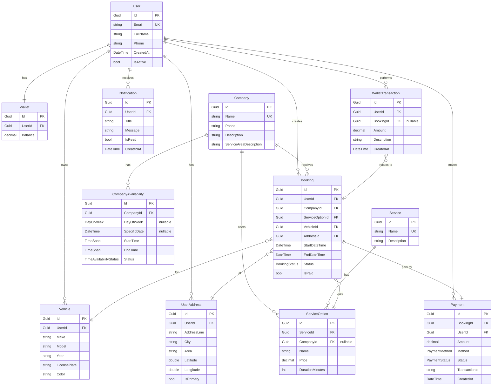

# ?? Ghseeli - Car Washing Service Platform

[](https://dotnet.microsoft.com/)
[](.)
[](https://cloud.google.com/sql)
[](https://docs.microsoft.com/ef/)

A comprehensive ASP.NET Core Web API for managing car washing services, including booking management, payment processing, and user wallet system.

---

## ?? **Table of Contents**

- [Features](#-features)
- [Architecture](#-architecture)
- [Database Schema](#-database-schema)
- [Prerequisites](#-prerequisites)
- [Installation](#-installation)
- [Configuration](#-configuration)
- [Running the Application](#-running-the-application)
- [Testing](#-testing)
- [API Endpoints](#-api-endpoints)
- [Project Structure](#-project-structure)
- [Technologies](#-technologies)

---

## ? **Features**

### **Core Functionality**
- ?? **User Management** - ASP.NET Identity integration with custom user profiles
- ?? **Vehicle Management** - Users can manage multiple vehicles
- ?? **Address Management** - Save multiple service addresses
- ?? **Company Management** - Service provider profiles and availability
- ?? **Service Catalog** - Multiple service types with customizable options
- ?? **Booking System** - Complete booking lifecycle management
- ?? **Payment Processing** - Multiple payment methods with refund support
- ?? **Wallet System** - Digital wallet for users
- ?? **Notifications** - User notification system

### **Business Features**
- **Booking Lifecycle:** Pending ? Confirmed ? In Progress ? Completed
- **Payment Status:** Pending ? Completed ? Refunded
- **Time Slot Management** - Conflict detection and availability checking
- **Company Availability** - Recurring and one-time availability slots
- **Service Duration Calculation** - Automatic end time calculation

---

## ??? **Architecture**

The application follows **Clean Architecture** principles with clear separation of concerns:

```
???????????????????????????????????????????????????????????????
?                      Presentation Layer                      ?
?                    (API Controllers)                         ?
???????????????????????????????????????????????????????????????
?                      Business Logic Layer                    ?
?                        (Handlers)                            ?
???????????????????????????????????????????????????????????????
?                      Data Access Layer                       ?
?                     (Repositories)                           ?
???????????????????????????????????????????????????????????????
?                      Database Layer                          ?
?              (Google Cloud SQL - PostgreSQL)                 ?
???????????????????????????????????????????????????????????????
```

### **Design Patterns Used**
- ? **Repository Pattern** - Data access abstraction
- ? **Handler Pattern** - Business logic isolation
- ? **Dependency Injection** - Loose coupling
- ? **DTO Pattern** - API request/response models
- ? **Validation Pattern** - IValidatable interface

---

## ??? **Database Schema**

### **Entity Relationship Diagram**



### **Key Relationships Explained**

#### **1. User Relationships**
- **User ? Vehicles (1:N)** - A user can own multiple vehicles
  - *Why:* Users may have multiple cars (personal, family)
  - *Delete Behavior:* Cascade (when user deleted, vehicles deleted)

- **User ? Addresses (1:N)** - A user can have multiple service addresses
  - *Why:* Home, work, or other locations
  - *Delete Behavior:* Cascade

- **User ? Wallet (1:1)** - Each user has exactly one wallet
  - *Why:* Single balance per user for simplicity
  - *Delete Behavior:* Cascade

- **User ? Bookings (1:N)** - A user can create multiple bookings
  - *Why:* Regular service users
  - *Delete Behavior:* Restrict (preserve booking history)

#### **2. Company Relationships**
- **Company ? ServiceOptions (1:N)** - Companies offer custom pricing
  - *Why:* Different companies may charge different prices
  - *Delete Behavior:* Set Null (generic service options preserved)

- **Company ? Bookings (1:N)** - Companies receive bookings
  - *Why:* Track which company serves which booking
  - *Delete Behavior:* Restrict (preserve history)

- **Company ? Availabilities (1:N)** - Define when company is available
  - *Why:* Companies have different operating hours
  - *Delete Behavior:* Cascade

#### **3. Booking Relationships**
- **Booking ? Payment (1:1)** - Each booking has one payment
  - *Why:* Single payment per service
  - *Delete Behavior:* Cascade (delete payment if booking deleted)

- **Booking ? ServiceOption (N:1)** - Multiple bookings can use same service
  - *Why:* Reusable service templates
  - *Delete Behavior:* Restrict (don't delete popular services)

- **Booking ? Vehicle (N:1)** - Multiple bookings for same vehicle
  - *Why:* Vehicle service history
  - *Delete Behavior:* Restrict (preserve history)

- **Booking ? Address (N:1)** - Multiple bookings at same address
  - *Why:* Repeat customers at same location
  - *Delete Behavior:* Restrict (preserve history)

#### **4. Service Structure**
- **Service ? ServiceOptions (1:N)** - Base service with variations
  - *Why:* "Basic Wash" ? [Small Car, Large Car, SUV pricing]
  - *Delete Behavior:* Cascade (delete options when service deleted)

#### **5. Payment & Wallet**
- **Payment ? Booking (1:1)** - Payment tied to specific booking
  - *Why:* Track what was paid for
  - *Delete Behavior:* Cascade

- **WalletTransaction ? Booking (N:1 optional)** - Some transactions relate to bookings
  - *Why:* Track wallet payments vs deposits
  - *Delete Behavior:* Set Null (preserve transaction even if booking deleted)

---

## ?? **Prerequisites**

- **.NET SDK 8.0 or 9.0** - [Download](https://dotnet.microsoft.com/download)
- **Google Cloud SQL** - PostgreSQL instance
- **Google Cloud SDK** - [Install](https://cloud.google.com/sdk/docs/install)
- **Visual Studio 2022** or **VS Code** (optional)
- **Git** - Version control

---

## ?? **Installation**

### **1. Clone the Repository**
```bash
git clone https://github.com/mohanadHaji/GhseeliApis.git
cd GhseeliApis
```

### **2. Restore Dependencies**
```bash
dotnet restore
```

### **3. Set Up Google Cloud SQL**

#### **Create PostgreSQL Instance:**
```bash
gcloud sql instances create ghseeli-db \
  --database-version=POSTGRES_15 \
  --tier=db-f1-micro \
  --region=us-central1
```

#### **Create Database:**
```bash
gcloud sql databases create ghseeli --instance=ghseeli-db
```

#### **Create Database User:**
```bash
gcloud sql users create ghseeli-user \
  --instance=ghseeli-db \
  --password=YOUR_SECURE_PASSWORD
```

### **4. Configure Connection String**

Edit `appsettings.Development.json`:

```json
{
  "ConnectionStrings": {
    "DefaultConnection": "Host=YOUR_CLOUD_SQL_IP;Database=ghseeli;Username=ghseeli-user;Password=YOUR_PASSWORD"
  },
  "Logging": {
    "LogLevel": {
      "Default": "Information",
      "Microsoft.AspNetCore": "Warning"
    }
  }
}
```

**For Cloud SQL Proxy:**
```json
{
  "ConnectionStrings": {
    "DefaultConnection": "Host=/cloudsql/YOUR_PROJECT:REGION:INSTANCE_NAME;Database=ghseeli;Username=ghseeli-user;Password=YOUR_PASSWORD"
  }
}
```

---

## ?? **Configuration**

### **appsettings.json Structure**

```json
{
  "ConnectionStrings": {
    "DefaultConnection": "YOUR_CONNECTION_STRING"
  },
  "Logging": {
    "LogLevel": {
      "Default": "Information",
      "Microsoft.AspNetCore": "Warning",
      "GhseeliApis": "Information"
    }
  },
  "AllowedHosts": "*"
}
```

### **Environment Variables (Optional)**

```bash
export ASPNETCORE_ENVIRONMENT=Development
export ConnectionStrings__DefaultConnection="YOUR_CONNECTION_STRING"
```

---

## ?? **Running the Application**

### **1. Apply Database Migrations**
```bash
cd GhseeliApis
dotnet ef database update
```

### **2. Run the Application**
```bash
dotnet run
```

The API will be available at:
- **HTTPS:** `https://localhost:7001`
- **HTTP:** `http://localhost:5000`
- **Swagger UI:** `https://localhost:7001` (Development only)

### **3. Using Cloud SQL Proxy (Recommended for Development)**

**Start the proxy:**
```bash
cloud_sql_proxy -instances=YOUR_PROJECT:REGION:INSTANCE_NAME=tcp:5432
```

**Then run the application:**
```bash
dotnet run
```

---

## ?? **Testing**

### **Run All Tests**
```bash
dotnet test
```

### **Run Tests with Coverage**
```bash
dotnet test --collect:"XPlat Code Coverage"
```

### **Test Statistics**
- **Total Tests:** 253
- **Passing:** 253 (100%)
- **Duration:** ~2.3 seconds
- **Coverage:** Handlers (100%), Models (73%), Infrastructure (100%)

### **Test Categories**
- **Handler Tests:** 119 tests - Business logic with Moq
- **Controller Tests:** 55 tests - API endpoint validation
- **Model Validation:** 49 tests - Data integrity
- **Infrastructure:** 30 tests - Logger, validators

---

## ?? **API Endpoints**

### **Users**
```
GET    /api/users              - Get all users
GET    /api/users/{id}         - Get user by ID
POST   /api/users              - Create user
PUT    /api/users/{id}         - Update user
DELETE /api/users/{id}         - Delete user
```

### **Vehicles**
```
GET    /api/vehicles                - Get all vehicles
GET    /api/vehicles/{id}           - Get vehicle by ID
GET    /api/vehicles/user/{userId}  - Get user's vehicles
POST   /api/vehicles                - Create vehicle
PUT    /api/vehicles/{id}           - Update vehicle
DELETE /api/vehicles/{id}           - Delete vehicle
```

### **Addresses**
```
GET    /api/addresses                - Get all addresses
GET    /api/addresses/{id}           - Get address by ID
GET    /api/addresses/user/{userId}  - Get user's addresses
POST   /api/addresses                - Create address
PUT    /api/addresses/{id}           - Update address
DELETE /api/addresses/{id}           - Delete address
PUT    /api/addresses/{id}/primary   - Set as primary
```

### **Companies**
```
GET    /api/companies        - Get all companies
GET    /api/companies/{id}   - Get company by ID
POST   /api/companies        - Create company
PUT    /api/companies/{id}   - Update company
DELETE /api/companies/{id}   - Delete company
```

### **Services**
```
GET    /api/services        - Get all services
GET    /api/services/{id}   - Get service by ID
POST   /api/services        - Create service
PUT    /api/services/{id}   - Update service
DELETE /api/services/{id}   - Delete service
```

### **Service Options**
```
GET    /api/serviceoptions                     - Get all service options
GET    /api/serviceoptions/{id}                - Get service option by ID
GET    /api/serviceoptions/service/{serviceId} - Get options for service
GET    /api/serviceoptions/company/{companyId} - Get company's options
POST   /api/serviceoptions                     - Create service option
PUT    /api/serviceoptions/{id}                - Update service option
DELETE /api/serviceoptions/{id}                - Delete service option
```

### **Bookings**
```
GET    /api/bookings                      - Get all bookings
GET    /api/bookings/{id}                 - Get booking by ID
GET    /api/bookings/user/{userId}        - Get user's bookings
GET    /api/bookings/company/{companyId}  - Get company's bookings
POST   /api/bookings                      - Create booking
PUT    /api/bookings/{id}                 - Update booking
POST   /api/bookings/{id}/cancel          - Cancel booking
POST   /api/bookings/{id}/confirm         - Confirm booking (company)
POST   /api/bookings/{id}/start           - Start service (company)
POST   /api/bookings/{id}/complete        - Complete service (company)
```

### **Payments**
```
GET    /api/payments                  - Get all payments
GET    /api/payments/{id}             - Get payment by ID
GET    /api/payments/my-payments      - Get user's payments
GET    /api/payments/booking/{id}     - Get payment for booking
POST   /api/payments                  - Create payment
PUT    /api/payments/{id}/status      - Update payment status
POST   /api/payments/{id}/refund      - Process refund
```

### **Health Check**
```
GET    /api/health        - Database health check
```

---

## ?? **Project Structure**

```
GhseeliApis/
??? Controllers/              # API Controllers
?   ??? UsersController.cs
?   ??? VehiclesController.cs
?   ??? AddressesController.cs
?   ??? CompaniesController.cs
?   ??? ServicesController.cs
?   ??? ServiceOptionsController.cs
?   ??? BookingsController.cs
?   ??? PaymentsController.cs
?   ??? HealthController.cs
?
??? Handlers/                 # Business Logic
?   ??? Interfaces/
?   ?   ??? IUserHandler.cs
?   ?   ??? IVehicleHandler.cs
?   ?   ??? IBookingHandler.cs
?   ?   ??? IPaymentHandler.cs
?   ??? UserHandler.cs
?   ??? VehicleHandler.cs
?   ??? BookingHandler.cs
?   ??? PaymentHandler.cs
?
??? Repositories/             # Data Access
?   ??? Interfaces/
?   ?   ??? IUserRepository.cs
?   ?   ??? IVehicleRepository.cs
?   ?   ??? IBookingRepository.cs
?   ??? UserRepository.cs
?   ??? VehicleRepository.cs
?   ??? BookingRepository.cs
?
??? Models/                   # Domain Entities
?   ??? User.cs
?   ??? Vehicle.cs
?   ??? Booking.cs
?   ??? Payment.cs
?   ??? Wallet.cs
?   ??? Enums/
?       ??? BookingStatus.cs
?       ??? PaymentStatus.cs
?       ??? PaymentMethod.cs
?
??? DTOs/                     # Data Transfer Objects
?   ??? User/
?   ??? Vehicle/
?   ??? Booking/
?   ??? Payment/
?
??? Persistence/              # Database Context
?   ??? ApplicationDbContext.cs
?   ??? ApplicationDbContextFactory.cs
?
??? Logger/                   # Logging Infrastructure
?   ??? Interfaces/
?   ?   ??? IAppLogger.cs
?   ??? ConsoleLogger.cs
?
??? Validators/               # Validation Utilities
?   ??? IdValidator.cs
?
??? Extensions/               # Extension Methods
?   ??? GoogleSqlSetupExtension.cs
?
??? Migrations/               # EF Core Migrations

GhseeliApis.Tests/
??? Handlers/                 # Handler Tests (Moq)
?   ??? UserHandlerTests.cs
?   ??? VehicleHandlerTests.cs
?   ??? BookingHandlerTests.cs
?   ??? PaymentHandlerTests.cs
?
??? Controllers/              # Controller Tests
?   ??? UsersControllerTests.cs
?   ??? HealthControllerTests.cs
?
??? Models/                   # Model Validation Tests
?   ??? UserValidationTests.cs
?   ??? BookingValidationTests.cs
?   ??? PaymentValidationTests.cs
?
??? Infrastructure/           # Infrastructure Tests
    ??? ConsoleLoggerTests.cs
    ??? IdValidatorTests.cs
```

---

## ??? **Technologies**

### **Backend**
- **ASP.NET Core 8.0/9.0** - Web API framework
- **Entity Framework Core 8.0** - ORM
- **ASP.NET Identity** - Authentication & Authorization
- **PostgreSQL** - Database (Google Cloud SQL)

### **Testing**
- **xUnit** - Test framework
- **Moq** - Mocking framework
- **FluentAssertions** - Assertion library

### **Database**
- **Google Cloud SQL** - Managed PostgreSQL
- **Cloud SQL Proxy** - Secure local connections

### **Patterns & Practices**
- Repository Pattern
- Handler/Service Pattern
- Dependency Injection
- Clean Architecture
- SOLID Principles

---

## ?? **Security Considerations**

### **Connection Strings**
- ? **Never commit** `appsettings.json` with real credentials
- ? Use **User Secrets** for development
- ? Use **Environment Variables** in production
- ? Use **Google Secret Manager** for cloud deployments

### **User Secrets Setup**
```bash
dotnet user-secrets init
dotnet user-secrets set "ConnectionStrings:DefaultConnection" "YOUR_CONNECTION_STRING"
```

### **Identity Configuration**
- Password requirements enforced
- Email uniqueness
- Account lockout after 5 failed attempts
- 8+ character passwords with upper, lower, and digit

---

## ?? **Database Migrations**

### **Create Migration**
```bash
dotnet ef migrations add MigrationName
```

### **Update Database**
```bash
dotnet ef database update
```

### **Rollback Migration**
```bash
dotnet ef database update PreviousMigrationName
```

### **Remove Last Migration**
```bash
dotnet ef migrations remove
```

---

## ?? **Troubleshooting**

### **Connection Issues**
```bash
# Test Cloud SQL connection
gcloud sql connect ghseeli-db --user=ghseeli-user

# Check if proxy is running
ps aux | grep cloud_sql_proxy

# Verify connection string
dotnet ef database update --verbose
```

### **Migration Issues**
```bash
# Reset database (Development only!)
dotnet ef database drop
dotnet ef database update

# Check pending migrations
dotnet ef migrations list
```

### **Common Errors**

**Error:** "No connection string found"
- **Fix:** Check `appsettings.json` or environment variables

**Error:** "Cloud SQL instance not found"
- **Fix:** Verify instance name and region in connection string

**Error:** "Authentication failed"
- **Fix:** Check username/password in Cloud SQL

---

## ?? **Development Workflow**

### **1. Create Feature Branch**
```bash
git checkout -b feature/your-feature-name
```

### **2. Implement Feature**
- Add model (if needed)
- Create repository interface & implementation
- Create handler interface & implementation
- **Write handler tests first!** (TDD)
- Create controller
- Add DTOs
- Run tests

### **3. Test**
```bash
dotnet test
```

### **4. Commit & Push**
```bash
git add .
git commit -m "feat: your feature description"
git push origin feature/your-feature-name
```

---

## ?? **Additional Resources**

- [ASP.NET Core Documentation](https://docs.microsoft.com/aspnet/core)
- [Entity Framework Core](https://docs.microsoft.com/ef/core)
- [Google Cloud SQL](https://cloud.google.com/sql/docs)
- [xUnit Documentation](https://xunit.net)
- [Moq Documentation](https://github.com/moq/moq4)

---

## ?? **Contributing**

1. Fork the repository
2. Create a feature branch
3. Write tests for your changes
4. Implement your feature
5. Ensure all tests pass
6. Submit a pull request

---

## ?? **License**

This project is licensed under the MIT License.

---

## ?? **Contact**

**Project Repository:** [github.com/mohanadHaji/GhseeliApis](https://github.com/mohanadHaji/GhseeliApis)

---

## ?? **Acknowledgments**

- Built with ?? using .NET 8/9
- Powered by Google Cloud SQL
- Tested with xUnit & Moq
- Following Clean Architecture principles

---

**Status:** ? Production Ready | ?? 253 Tests Passing | ? 2.3s Test Execution
