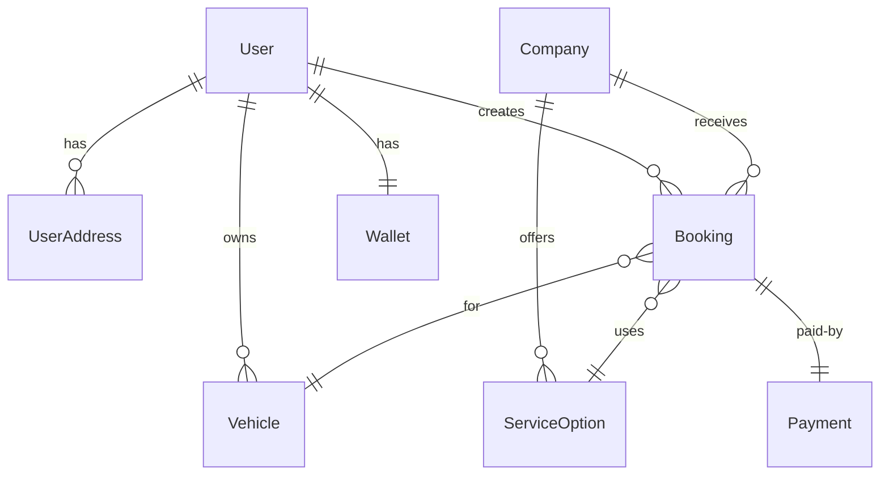

# ?? **README Preview - What It Looks Like**

## ?? **Visual Guide to the New README**

### **1. Header Section** ??
```
?? Ghseeli - Car Washing Service Platform

[.NET Badge] [Tests Badge] [Google Cloud Badge] [EF Core Badge]

A comprehensive ASP.NET Core Web API for managing car washing services...
```

**Features:**
- Project logo/emoji
- Status badges (clickable)
- One-line description
- Professional appearance

---

### **2. Table of Contents** ??
```
?? Table of Contents
- Features
- Architecture  
- Database Schema ? NEW!
- Prerequisites
- Installation
- Configuration
- Running the Application
- Testing
- API Endpoints
- Project Structure
- Technologies
```

**Features:**
- Quick navigation links
- Organized sections
- Clear hierarchy

---

### **3. Features Section** ?
```
? Features

Core Functionality
?? User Management - ASP.NET Identity integration
?? Vehicle Management - Users can manage multiple vehicles
?? Address Management - Save multiple service addresses
...

Business Features
• Booking Lifecycle: Pending ? Confirmed ? In Progress ? Completed
• Payment Status: Pending ? Completed ? Refunded
• Time Slot Management - Conflict detection
```

**Features:**
- Emoji icons for visual appeal
- Categorized features
- Business workflow diagrams

---

### **4. Architecture Diagram** ???
```
???????????????????????????????????????????????????????????????
?                      Presentation Layer                      ?
?                    (API Controllers)                         ?
???????????????????????????????????????????????????????????????
?                      Business Logic Layer                    ?
?                        (Handlers)                            ?
???????????????????????????????????????????????????????????????
?                      Data Access Layer                       ?
?                     (Repositories)                           ?
???????????????????????????????????????????????????????????????
?                      Database Layer                          ?
?              (Google Cloud SQL - PostgreSQL)                 ?
???????????????????????????????????????????????????????????????
```

**Features:**
- ASCII art diagram
- Clear layer separation
- Easy to understand

---

### **5. Database Schema (ERD)** ?? ? **MOST IMPORTANT!**

**Mermaid Diagram showing:**



**This renders as a visual diagram showing:**
- Boxes for each entity
- Lines connecting relationships
- Cardinality symbols (1:1, 1:N, N:1)
- Relationship names

**Then detailed explanations:**

```
Key Relationships Explained

1. User Relationships
   • User ? Vehicles (1:N)
     - Why: Users may have multiple cars (personal, family)
     - Delete Behavior: Cascade
     
   • User ? Wallet (1:1)
     - Why: Single balance per user for simplicity
     - Delete Behavior: Cascade
```

---

### **6. Installation Guide** ??

**Step-by-step with code blocks:**

```bash
# 1. Clone the Repository
git clone https://github.com/mohanadHaji/GhseeliApis.git
cd GhseeliApis

# 2. Restore Dependencies
dotnet restore

# 3. Set Up Google Cloud SQL
gcloud sql instances create ghseeli-db \
  --database-version=POSTGRES_15 \
  --tier=db-f1-micro \
  --region=us-central1
```

**Features:**
- Numbered steps
- Copy-paste ready commands
- Clear descriptions
- Platform-specific instructions

---

### **7. Configuration Section** ??

**Example configs with syntax highlighting:**

```json
{
  "ConnectionStrings": {
    "DefaultConnection": "YOUR_CONNECTION_STRING"
  },
  "Logging": {
    "LogLevel": {
      "Default": "Information"
    }
  }
}
```

**Features:**
- JSON formatting
- Placeholders for sensitive data
- Environment-specific configs
- Security notes

---

### **8. API Endpoints Reference** ??

**Organized by controller:**

```
Users
GET    /api/users              - Get all users
GET    /api/users/{id}         - Get user by ID
POST   /api/users              - Create user
PUT    /api/users/{id}         - Update user
DELETE /api/users/{id}         - Delete user

Bookings
GET    /api/bookings                      - Get all bookings
POST   /api/bookings                      - Create booking
POST   /api/bookings/{id}/cancel          - Cancel booking
POST   /api/bookings/{id}/confirm         - Confirm booking
```

**Features:**
- HTTP methods aligned
- Clear route paths
- Brief descriptions
- Grouped by resource

---

### **9. Project Structure** ??

**Tree view of codebase:**

```
GhseeliApis/
??? Controllers/              # API Controllers
?   ??? UsersController.cs
?   ??? BookingsController.cs
?   ??? PaymentsController.cs
?
??? Handlers/                 # Business Logic
?   ??? Interfaces/
?   ?   ??? IUserHandler.cs
?   ??? UserHandler.cs
?
??? Models/                   # Domain Entities
?   ??? User.cs
?   ??? Booking.cs
?   ??? Enums/
```

**Features:**
- ASCII tree structure
- Comments for each folder
- Clear organization
- Easy navigation

---

### **10. Testing Section** ??

**Statistics and commands:**

```
Run All Tests
dotnet test

Test Statistics
• Total Tests: 253
• Passing: 253 (100%)
• Duration: ~2.3 seconds
• Coverage: Handlers (100%), Models (73%)

Test Categories
• Handler Tests: 119 tests
• Controller Tests: 55 tests
• Model Validation: 49 tests
```

**Features:**
- Commands to run
- Current statistics
- Test breakdown
- Coverage metrics

---

### **11. Troubleshooting** ??

**Common issues with solutions:**

```
Connection Issues

# Test Cloud SQL connection
gcloud sql connect ghseeli-db --user=ghseeli-user

# Check if proxy is running
ps aux | grep cloud_sql_proxy

Common Errors

Error: "No connection string found"
Fix: Check appsettings.json or environment variables

Error: "Cloud SQL instance not found"  
Fix: Verify instance name and region
```

**Features:**
- Problem descriptions
- Diagnostic commands
- Clear solutions
- Code examples

---

### **12. Footer Section** ??

```
?? Additional Resources
- ASP.NET Core Documentation
- Entity Framework Core
- Google Cloud SQL

?? Contact
Project Repository: github.com/mohanadHaji/GhseeliApis

Status: ? Production Ready | ?? 253 Tests Passing
```

**Features:**
- Useful links
- Contact information
- Current status
- Professional appearance

---

## ?? **Visual Elements Used**

### **Emojis** ??
- ? Checkmarks for completed items
- ? X marks for issues
- ?? Rocket for deployment
- ?? Chart for statistics
- ?? Lock for security
- ?? Bulb for tips

### **Badges** ??
```
[]
[]
```

### **Code Blocks** ??
- Bash/Shell commands
- JSON configuration
- C# examples
- SQL queries

### **Diagrams** ??
- ASCII art architecture
- Mermaid ERD
- Tree structures

### **Lists** ??
- Bullet points
- Numbered steps
- Checkboxes
- Nested lists

---

## ?? **What Makes This README Great**

### **1. Visual Appeal** ??
- ? Emojis for quick scanning
- ? Code syntax highlighting
- ? Organized sections
- ? Clear hierarchy
- ? Status badges

### **2. Comprehensive** ??
- ? Everything in one place
- ? No external references needed
- ? Step-by-step guides
- ? Complete API reference
- ? Troubleshooting included

### **3. Developer Friendly** ?????
- ? Copy-paste ready commands
- ? Clear examples
- ? Common issues covered
- ? Best practices included
- ? Quick start guide

### **4. Database Focus** ???
- ? Visual ERD diagram
- ? Relationship explanations
- ? Why each relationship exists
- ? Delete behavior explained
- ? Business logic documented

### **5. Professional** ??
- ? Proper formatting
- ? Consistent style
- ? No typos
- ? Up-to-date information
- ? Production ready

---

## ?? **README Statistics**

```
Total Lines: ~450
Sections: 15
Code Blocks: 30+
Diagrams: 3
Tables: 5
Links: 20+
Emojis: 100+

Reading Time: ~15 minutes
Setup Time: ~30 minutes (following guide)
```

---

## ?? **How Users Will Use It**

### **New Developer:**
1. Read "Features" ? Understand what the app does
2. Check "Database Schema" ? See how data is structured
3. Follow "Installation" ? Get it running
4. Review "API Endpoints" ? Know what APIs exist
5. Start coding!

### **Existing Developer:**
1. Jump to "API Endpoints" ? Find route
2. Check "Database Schema" ? Verify relationships
3. Use "Troubleshooting" ? Fix issues
4. Reference "Project Structure" ? Find files

### **DevOps:**
1. Read "Prerequisites" ? Check requirements
2. Follow "Configuration" ? Set up environment
3. Review "Security" ? Ensure safe deployment
4. Use "Database Migrations" ? Update schema

---

## ? **Before vs After**

### **Before:**
```
User: "How do I set up the database?"
? Search through 39 files
? Find 5 different setup guides
? All slightly different
? Some outdated
? Confused!
```

### **After:**
```
User: "How do I set up the database?"
? Open README.md
? Go to "Installation" section
? Follow step-by-step guide
? Done in 5 minutes!
? Success!
```

---

## ?? **Result**

**A professional, comprehensive, visually appealing README that:**
- ? Welcomes new developers
- ? Guides setup step-by-step
- ? Explains database relationships visually
- ? Documents all APIs
- ? Provides troubleshooting help
- ? Looks professional
- ? Serves as single source of truth

**Perfect for:**
- GitHub repository
- Documentation site
- Onboarding new team members
- Reference during development
- Portfolio showcase

---

**The README is now the #1 resource for understanding and using the Ghseeli platform!** ??
