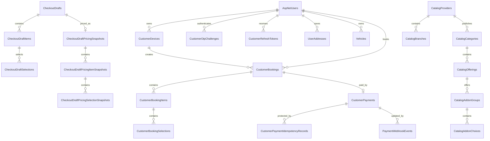
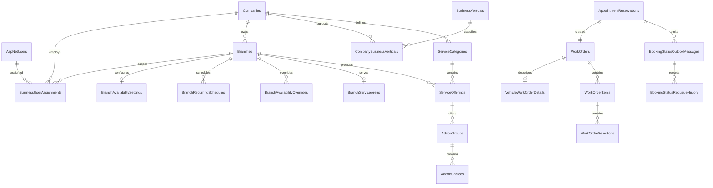

# Ghseeli APIs

Ghseeli is a car-wash and vehicle-services backend composed of two independently
deployed ASP.NET Core APIs:

- **Customer API** for customer identity, devices, catalog browsing, checkout,
  bookings, and payments.
- **Business API** for business identity, companies, branches, catalog
  management, availability, reservations, and work orders.

Both APIs are deployed and use separate SQL Server databases.

| Service | Hosted URL | Swagger |
|---|---|---|
| Customer API | <https://ghseelicustomer.runasp.net> | <https://ghseelicustomer.runasp.net/swagger> |
| Business API | <https://ghseelibusiness.runasp.net> | <https://ghseelibusiness.runasp.net/swagger> |

## Solution

| Project | Target | Responsibility |
|---|---:|---|
| `Ghseeli.CustomerApi` | .NET 8 | Customer-facing API and Customer database |
| `Ghseeli.BusinessApi` | .NET 8 | Business-facing API and Business database |
| `Ghseeli.IntegrationContracts` | .NET 8 | Neutral versioned HTTP DTOs, enums, and integration constants |
| `Ghseeli.Common` | .NET 8 | Shared logging infrastructure |
| `Ghseeli.DemoData` | .NET 8 | Deterministic Demo fixture export, local seeding, and guarded hosted seeding |
| `Ghseeli.CustomerApi.Tests` | .NET 9 | Customer unit, integration, relational, migration, and HTTP tests |
| `Ghseeli.BusinessApi.Tests` | .NET 9 | Business unit, integration, relational, migration, and HTTP tests |
| `Ghseeli.DemoData.Tests` | .NET 9 | Demo fixture, isolation, cleanup, and seeding tests |

The APIs never reference each other's implementation projects and never access
each other's databases. Cross-service communication uses HTTPS, versioned
integration contracts, and HMAC authentication.

```text
Customer client
      |
      v
Ghseeli.CustomerApi ---- signed HTTPS/HMAC ----> Ghseeli.BusinessApi
      |                                                |
      v                                                v
Customer SQL database                          Business SQL database
```

Each API generally follows:

```text
Controllers -> Handlers/Services -> Repositories -> EF Core -> owned database
```

## Service ownership

| Domain | Owner |
|---|---|
| Customer accounts, OTP, refresh tokens, devices, vehicles, and addresses | Customer API |
| Customer-facing catalog cache | Customer API |
| Checkout drafts, price snapshots, customer bookings, and payments | Customer API |
| Business accounts, companies, branches, and employee assignments | Business API |
| Catalog definitions, authoritative prices, add-ons, and durations | Business API |
| Availability, schedules, closures, service areas, and capacity | Business API |
| Appointment reservations, work orders, and operational booking status | Business API |

## Main flows

| Flow | Description |
|---|---|
| Anonymous discovery | Register a device, read configuration, browse catalog, search slots, and create a checkout draft |
| Customer authentication | Register or log in with password, email OTP, or refresh token |
| Booking | Reprice a draft, authenticate the customer, and reserve the appointment through the Business API |
| Business operations | Staff manage the catalog and move work orders through their status lifecycle |
| Status synchronization | Business sends signed outbox callbacks to update the Customer booking |
| Payment | Customer initializes Lahza hosted checkout and the backend verifies webhook/provider state |

## Authentication

| Credential | Caller | Usage |
|---|---|---|
| `CustomerBearer` | Logged-in customer frontend | Customer account operations, booking, and payment |
| `X-Device-Token` | Customer frontend installation | Anonymous and authenticated `/api/v1` Customer operations |
| `BusinessBearer` | Business owner/staff frontend | Business management operations |
| `X-Service-Id`, `X-Timestamp`, `X-Nonce`, `X-Signature` | Customer and Business APIs | Internal HMAC-authenticated requests |
| `X-Lahza-Signature` | Lahza | Exact-body webhook authentication |

Frontend applications use only the applicable bearer token and device token.
HMAC and Lahza secrets must never be provided to frontend code.

Typical Customer flow:

```text
Before login: X-Device-Token
After login:  X-Device-Token + Authorization: Bearer <customer-jwt>
```

## Production and Demo isolation

The hosted databases contain both Production and Demo records, separated by a
trusted `IsDemo` partition:

- existing and normal records use `IsDemo=false`;
- canonical frontend Demo records use `IsDemo=true`;
- public clients cannot choose or override the partition;
- Customer partition comes from trusted devices/accounts and JWT claims;
- Business partition comes from trusted accounts and JWT claims;
- signed internal calls propagate the partition;
- Production and Demo records are mutually invisible;
- mismatched JWT and device partitions return `403`;
- Demo OTP uses `111111` without email delivery;
- Demo payments never contact Lahza.

Frontend handoff:

- [`FRONTEND_DEMO_HANDOFF.md`](GhseeliApis/demo-data/FRONTEND_DEMO_HANDOFF.md)
- [`frontend-demo-data.json`](GhseeliApis/demo-data/frontend-demo-data.json)

Quick Demo credentials:

```text
Customer: maya.demo@example.test
Business: owner.sparkle@example.test
Password: Demo123!
OTP: 111111
```

The JSON contains all deterministic accounts, IDs, device tokens, companies,
catalog records, drafts, bookings, reservations, work orders, and payment
examples currently seeded in the hosted Demo partition.

## Databases

The Customer and Business APIs have separate SQL Server databases, DbContexts,
migrations, credentials, and deployment settings.

### Customer database

Primary DbContext:
`Ghseeli.CustomerApi\Persistence\ApplicationDbContext.cs`

| Area | Tables |
|---|---|
| Identity | `AspNetUsers`, `AspNetRoles`, `AspNetRoleClaims`, `AspNetUserClaims`, `AspNetUserLogins`, `AspNetUserRoles`, `AspNetUserTokens` |
| Customer access | `CustomerDevices`, `CustomerOtpChallenges`, `CustomerRefreshTokens` |
| Customer profile | `UserAddresses`, `Vehicles` |
| Configuration | `CustomerConfigurations` |
| Catalog cache | `CatalogProviders`, `CatalogBranches`, `CatalogCategories`, `CatalogOfferings`, `CatalogAddonGroups`, `CatalogAddonChoices` |
| Checkout | `CheckoutDrafts`, `CheckoutDraftItems`, `CheckoutDraftSelections` |
| Pricing snapshots | `CheckoutDraftPricingSnapshots`, `CheckoutDraftPricingItemSnapshots`, `CheckoutDraftPricingSelectionSnapshots` |
| Booking | `CustomerBookings`, `CustomerBookingItems`, `CustomerBookingSelections`, `BookingConfirmationAttempts`, `ProcessedBookingStatusMessages` |
| Payment | `CustomerPayments`, `CustomerPaymentIdempotencyRecords`, `PaymentWebhookEvents` |
| Internal security | `CustomerInternalServiceNonces`, `CustomerInternalIdempotencyRecords` |

Core Customer relationships:



Important behavior:

- deleting a Customer cascades to owned addresses, vehicles, OTP challenges,
  and refresh tokens where configured;
- devices can survive a Customer relationship change and may be unbound;
- drafts are owned by devices before login;
- bookings snapshot catalog and pricing data rather than depending on mutable
  Business database rows;
- payment and webhook records belong only to the Customer database.

### Business database

Primary DbContext:
`Ghseeli.BusinessApi\Persistence\BusinessDbContext.cs`

| Area | Tables |
|---|---|
| Identity | `AspNetUsers`, `AspNetRoles`, `AspNetRoleClaims`, `AspNetUserClaims`, `AspNetUserLogins`, `AspNetUserRoles`, `AspNetUserTokens` |
| Business ownership | `Companies`, `Branches`, `BusinessUserAssignments` |
| Business verticals | `BusinessVerticals`, `CompanyBusinessVerticals` |
| Availability | `BranchAvailabilitySettings`, `BranchRecurringSchedules`, `BranchAvailabilityOverrides`, `BranchServiceAreas` |
| Catalog | `ServiceCategories`, `ServiceOfferings`, `AddonGroups`, `AddonChoices` |
| Booking operations | `AppointmentReservations`, `WorkOrders`, `VehicleWorkOrderDetails`, `WorkOrderItems`, `WorkOrderSelections` |
| Status delivery | `BookingStatusOutboxMessages`, `BookingStatusRequeueHistory` |
| Internal security | `InternalServiceNonces`, `InternalServiceIdempotencyRecords` |

Core Business relationships:



Important behavior:

- a Company owns its branches, assignments, catalog, availability, and
  reservations;
- a Branch is the authority for service area, schedules, capacity, and
  available offerings;
- every reservation has at most one operational work order;
- status callbacks are stored in a durable outbox before delivery to Customer;
- Business payment data does not exist because payments belong to Customer.

### Cross-database connections

There are no SQL foreign keys between the databases. Integration uses public
IDs and references:

| Customer record | Business record | Connection |
|---|---|---|
| Catalog provider/cache | Company publication | Business company/provider ID |
| Checkout draft | Branch and offerings | Public company, branch, offering, and add-on IDs |
| Customer booking | Appointment reservation | Customer booking reference |
| Customer booking | Work order | Business reservation/work-order public IDs |
| Processed status message | Outbox message | Signed event ID and idempotency key |

The Customer API must never query the Business database, and the Business API
must never query the Customer database.

## Configuration

Never place real credentials in source-controlled configuration. Development
uses .NET user secrets; deployment uses GitHub `Production` environment
secrets.

Connection-string keys:

```text
Customer: ConnectionStrings:CustomerConnection
Business: ConnectionStrings:BusinessConnection
```

Minimum local configuration:

```powershell
dotnet user-secrets set "ConnectionStrings:CustomerConnection" "<customer-sql-connection>" --project .\Ghseeli.CustomerApi\Ghseeli.CustomerApi.csproj
dotnet user-secrets set "JwtSettings:SecretKey" "<customer-jwt-secret>" --project .\Ghseeli.CustomerApi\Ghseeli.CustomerApi.csproj

dotnet user-secrets set "ConnectionStrings:BusinessConnection" "<business-sql-connection>" --project .\Ghseeli.BusinessApi\Ghseeli.BusinessApi.csproj
dotnet user-secrets set "BusinessJwtSettings:SecretKey" "<business-jwt-secret>" --project .\Ghseeli.BusinessApi\Ghseeli.BusinessApi.csproj
```

Cross-API HMAC configuration requires different secrets for each direction:

```text
Customer -> Business: BusinessApiClient
Business -> Customer: CustomerBookingStatusClient
```

Production integrations additionally use protected SMTP and Lahza secrets.

## Build, test, and run

Run commands from `GhseeliApis`, which contains `GhseeliApis.sln`.

```powershell
dotnet restore
dotnet build
dotnet test
```

Current verified baseline:

| Test project | Passed |
|---|---:|
| Customer | 1,311 |
| Business | 586 |
| Demo data | 23 |
| **Total** | **1,920** |

Run locally:

```powershell
dotnet run --project .\Ghseeli.CustomerApi\Ghseeli.CustomerApi.csproj
dotnet run --project .\Ghseeli.BusinessApi\Ghseeli.BusinessApi.csproj
```

Database migrations:

```powershell
dotnet ef database update --project .\Ghseeli.CustomerApi\Ghseeli.CustomerApi.csproj --startup-project .\Ghseeli.CustomerApi\Ghseeli.CustomerApi.csproj

dotnet ef database update --project .\Ghseeli.BusinessApi\Ghseeli.BusinessApi.csproj --startup-project .\Ghseeli.BusinessApi\Ghseeli.BusinessApi.csproj
```

## Deployment

Production deployment is manual:

```powershell
gh workflow run deploy-monsterasp.yml --ref master
```

The workflow tests and builds the solution, migrates both databases, publishes
both APIs, injects runtime configuration, deploys them, and verifies database
health.

Hosted Demo seeding is a separate manual workflow protected by an exact
confirmation and the GitHub `Production` environment:

```powershell
gh workflow run seed-hosted-demo.yml --ref master -f "confirmation=SEED HOSTED DEMO"
```

Remote Demo cleanup is intentionally unavailable.

## Documentation retained

The root README describes the system and databases. The solution-level README
is a working handoff for future coding agents. Other retained Markdown files
have active, non-overlapping purposes:

| Document | Purpose |
|---|---|
| `GhseeliApis/README.md` | Completed work, known gaps, future improvements, and testing handoff for agents |
| `GhseeliApis/API_BOUNDARIES.md` | Detailed ownership, security, and integration invariants |
| `GhseeliApis/HTTP_TEST_PLAN_STANDARD.md` | Required test-first HTTP process |
| `GhseeliApis/docs/FRONTEND_AI_INTEGRATION_GUIDE.md` | Detailed frontend implementation contract |
| `GhseeliApis/demo-data/FRONTEND_DEMO_HANDOFF.md` | Hosted Demo credentials, data, and expected results |
| Active `STEP_*` plans | Inputs consumed by retained HTTP validation scripts |
| `.github/copilot-instructions.md` | Repository-wide engineering instructions |

Swagger/OpenAPI is the source of truth for endpoint paths, schemas, validation,
security requirements, and status codes.
